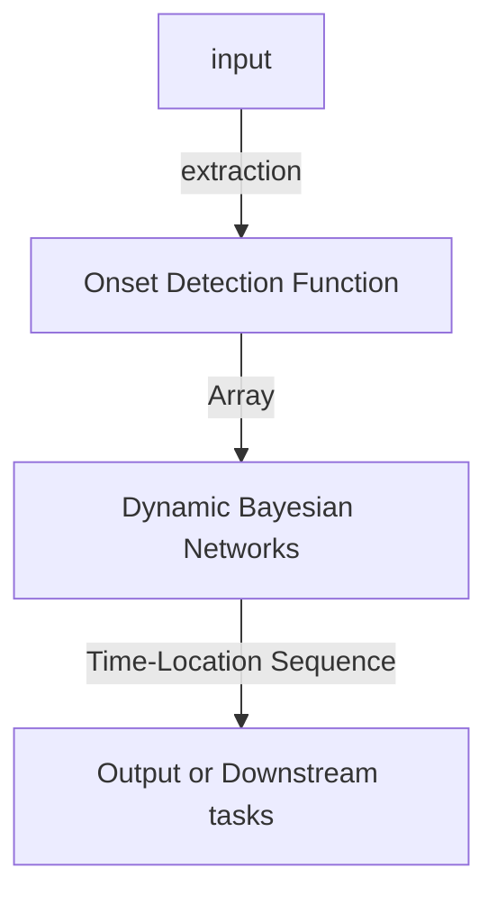
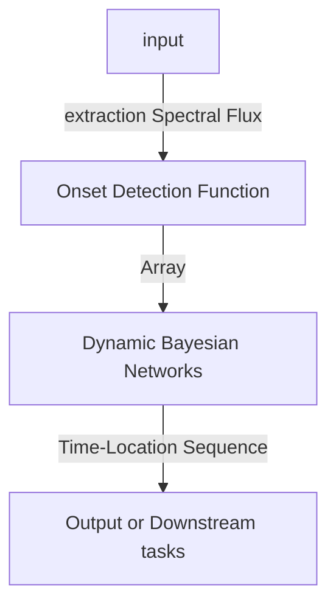

# Beat Tracking

## 背景

在音乐信息检索（Music Information Retrieval, MIR）领域，节拍跟踪（Beat Tracking）是一项基础且至关重要的任务。它旨在模拟人类感知音乐节奏的能力，自动从音频信号中定位出构成音乐骨架的节拍点（beats）。节拍作为音乐时间结构的基本单位，是听众感知和响应音乐（如点头、跟唱、跳舞）的心理物理基础。因此，精确的节拍跟踪不仅是理解音乐内容的关键，也为众多下游应用提供了核心的时域基准。

其意义在于，一个可靠的节拍跟踪系统能够将复杂的音频信号转化为结构化的节奏信息，从而赋能各种创造性和分析性应用。从专业的音乐制作、DJ表演到个性化的音乐推荐与交互，节拍信息都扮演着不可或缺的角色。随着深度学习技术的发展，节拍跟踪的精度和鲁棒性得到了显著提升，使其在更广泛的场景中展现出巨大的应用潜力。

## 问题定义

节拍跟踪的核心目标是，给定一段音乐音频，算法需要输出一个时间序列，该序列中的每个时间点对应一个被人类听众感知为“节拍”的时刻。这些节拍通常以一个相对稳定的速率（即速度，tempo）出现，并构成了一个准等时（quasi-isochronous）的脉冲序列。

此任务有几个核心概念：

- 节拍（Beat）: 感知上的等时脉冲，是听众会跟随“打拍子”的基本时间点。
- 速度（Tempo）: 节拍发生的速率，通常以“每分钟节拍数”（Beats Per Minute, BPM）为单位。
- 重拍（Downbeat）: 每个小节（bar）的第一个节拍，通常在听感上更强或具有和声解决感，是更高层级节拍结构的起点。
- 节拍模式（Meter）: 定义了每个小节包含多少个节拍（如 4/4 拍、3/4 拍），以及节拍之间的强弱关系。

节拍跟踪系统通常需要处理这些概念，有时是独立估计，有时则是联合建模以获得更准确、更具音乐意义的结果

## 任务分类

根据实时性、输出信息和应用场景，节拍跟踪任务可分为不同类别：

- 离线 vs. 在线(Real Time): 
    离线算法可以处理整首歌曲，利用全局信息获得最高精度。而在线或因果（causal）算法则只能利用过去的信息，适用于需要低延迟响应的场景。
- 仅节拍 vs. 联合估计: 
    基础任务只输出节拍时间点。更复杂的任务则会联合输出速度、重拍和节拍模式。

节拍跟踪技术的应用领域极其广泛，涵盖了从学术研究到商业产品的多个层面：

- 音乐分析与检索: 作为节拍同步特征提取（beat-synchronous analysis）的基础，用于和弦识别、曲式分析、封面歌曲识别等。
- 音乐创作与表演: 自动对齐音频片段，辅助 DJ 进行无缝混音（beatmatching）、制作 mashup 和循环乐段（looping）。
- 自动转录与对齐: 将演奏的 MIDI 数据与乐谱进行节拍层面的对齐和量化，实现从表演到乐谱的转换。
- 交互式应用: 在节奏游戏、虚拟现实（VR）、增强现实（AR）以及舞蹈辅助应用中，实现音视觉同步。
- 其他领域: 如从舞者的视频中反向推断音乐节拍（视觉节拍跟踪，或用于音乐治疗的节奏引导。

## 经典范式:

## 前DL时代

检测频谱波动的周期性变化来动态切分乐曲

