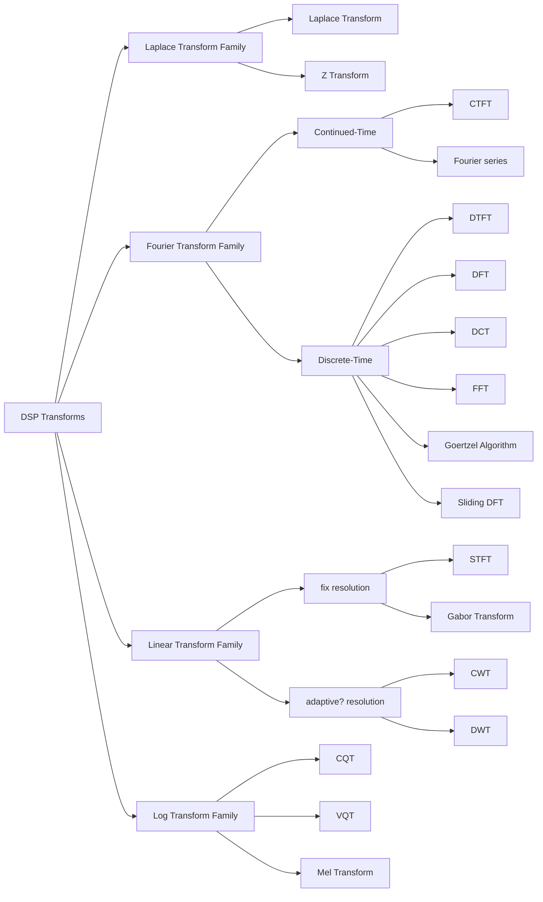

# DSP领域常用变换速查表[WIP 长期更新]

## 谱系图

## 傅里叶变换

### 短时傅里叶变换-STFT

<big>定义</big>

    
STFT是傅里叶变换的一种变形,也被称为加窗傅里叶变换,计算STFT的过程是将较长时间信号分割成长度相等的较短段，然后分别计算每个较短段的傅里叶变换
    
通常按照时间绘制频谱变化(Changing spectra as a function of time),也就是频谱或者是瀑布图

<big>计算</big>

- 连续时间STFT

$$ 
STFT\{x(t)\}(\tau,\omega) \equiv X(\tau,\omega) = \int_{-\infty}^{\infty}x(t)w(t-\tau)e^{-i \omega t}dt
$$ 

其中 $w(\tau)$ 是窗口函数, $x(t)$ 是需要变换的信号 

$X(\tau,\omega)$ 本质上是 $x(t)w(t-\tau)$ 的傅里叶变化,它是一个复函数，表示信号随时间和频率变化的相位和幅度.
通常,相位展开会使用在时间轴 $\tau$ 与频率轴 $\omega$ 上用以解决相位的跳变问题

- 离散时间STFT

$$ 
STFT[x(n)](m,\omega) \equiv X(m,\omega) = \sum_{n=-\infty}^{\infty}x[n]w[n-m]e^{-i \omega n}
$$ 

离散时间的情况下,被转换数据可以被拆分成块或者帧(通常有重叠,用于降低伪影Artifact),每个区块都经过傅里叶变换,复数的结果加入一个矩阵

和连续时间很像,其中 $w[n]$ 是窗口函数, $x[n]$ 是需要变换的信号,在这个公式中m是离散的, $\omega$ 是连续的,但是在大多数应用场景下,STFT是通过快速傅里叶变换实现的,因此这两个变量

<big>作用</big>

STFT以及标准傅里叶变换通常被用于音乐分析,其时域-频域转换与可逆的特性让它在音频处理中属于主力

其应用场景如下[WIP 正在寻找更多的证明]
1. 降噪
2. 变调与变速
3. 音频分离
4. TTS
5. 信号分析

<big>问题</big>

1. 分辨率固定

由于分辨率固定所以在时域和频域之间只能选择一个测准:

长窗口 +频率分辨率高 -时间分辨率低

短窗口 +时间分辨率高 -频率分辨率低

简单来说就是无法同时看清瞬态和和声

2. 线性频率分布

STFT的频率轴是等距线性的,也就意味着它不符合人类的常见的log分布

带来的主要问题是在低频区域分辨率过低(多个频率挤占同一格子),高频区域分辨率过高(浪费格子)

3. 频谱泄露

STFT会把信号/数据按照一个一个格子切开,在切开的时候波形不在零点上就会产生跳变

根据傅里叶的理论,直角边缘会产生无限多的高频伪影,所以一定会使用窗函数来压平边缘部分,但是这又会导致边缘信息丢失
因此在使用中一般会选择50%或者75%的窗口重叠(Overlap),增加了计算量

4. 瞬态响应无法处理[WIP]

瞬时突变信号与STFT的假设(切出来的小窗口中,信号是平稳的)冲突,会导致计算结果不精确

:::Note
除了奈奎斯特频率限制了上限之外,瑞利频率也限制了分辨率

简单来说要想在频谱上分辨出两个相近的频率成分，这两个频率的差值 $\Delta f$ 必须大于等于观察时间 $T$ 的倒数

公式:
$\Delta f \ge \frac{1}{T}$

例如截取0.1秒的片段分析,分辨率的极限是10Hz

如果音频中同时包含440Hz和450Hz的声音时,频谱上能看见两个峰值,但是如果音频里面是440Hz和445Hz,那就只有一个宽大的峰值了

窗函数会让瑞丽限制上升[具体数据查证中]

原理大意是瑞利限制和主瓣宽度直接相关,窗函数让主瓣变宽的时候会导致等效分辨率下降

补零(Zero-Padding)**无法解决**这个问题
:::

<big>实现方法</big>

目前有如下几种主要的实现方法,在此只做罗列,不详细叙述(我也没搞明白:-()

1. 直接计算法
2. 基于FFT的实现
3. 递归/滑动DFT()
4. Goertzel 算法
5. Chirp Z Transform
6. Polyphase Filterbank
7. Sparse FFT/sFFT
8. MDCT(存疑,和STFT类似但好像不是STFT)

## 对数变换

### 恒定Q变换-CQT

<big>定义</big>

<big>计算</big>

<big>作用</big>

<big>实现方法</big>

:::Note

:::

### 模板

<big>定义</big>

<big>计算</big>

<big>作用</big>

<big>实现方法</big>

:::Note

:::