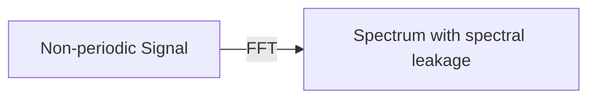
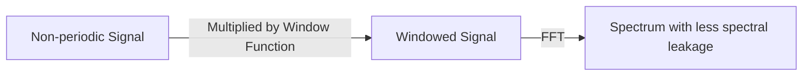

# Windowing

## 0.[Colab Codes](https://colab.research.google.com/drive/1jkihJj20s5pTQXZI450owh5qw57-bLng?usp=sharing)

## 1.What is Windowing

- Windowing is the process of taking a small subset of a larger dataset, for processing and analysis
- Windowing is accompished using a window fuction or a tapering function

## 2.Why we need windowing

There are two types of signal measurement 

Periodic Measurement

- Rare
- Captured signals are symmetric and can be appended to create a continuous infinite waveform
- FFT of periodic signal is **accurate**

Non-Periodic Measurement

- Usually, captured signal are fall into this cagatory
- Captured signals are not symmetric
- Appending the signals would not produce the original continuous infinite waveform
- FFT of non-periodic signal is **misleading**

Spectral Leakage

- When a non-periodically signal is appended in the `time domain`, it produces **discontinuities**
- These discontinuities,which are short events in the time domain result in wide events in the `frequency domain`
- The wide spread in the frequency domain stemming from the original spectral line is the spectral leakage
- Spectral leakage is a consequence of non-periodic measurement
- Windowing functions are used to alleviate spectral leakage

## 3.Window Function

### 3.1.Definition

- A window funcion is a mathematical function that is zero valued outside of some chosen interval, symmetric around middle interval, having maximum value in the middle and tapers away from the middle
- The main purpose of a window is to reduce the sharp discontinuities that occur when trying to append non-periodically measured signal
- There are different types of windows catered to specific signal processing requirements

### 3.2.Process

Non periodically 
-> Signal multiplied by chosen window function 
-> Windowed signal than appended to create continuous waveform
-> Sharp edges are reduced due to windowing

- with out windowing

- with windowing

:::note
Convolving a window function with a signal sets the signal values before and after the window to zero, thereby preventing discontinuities caused by jumps when expanding the signal
:::

### 3.3.Window corrections

- Windowed signal does **NOT** exactly resemble the actual waveform
- There is a compromise on both **Amplitude** and **energy** of the original signal
- Corrections are available for each window type but both amplitude and energy corrections **CANNOT** be applied ant the same time
:::CAUTION
If you windowing a periodically captured signal，it would result in spectal leakage in the frequency domain.
:::

## 4.Window Types

### 4.1.Ideal Window

- An Idel window would have a narrow main lobe width and high attenuation of the side lobes
- For a pure tone in the frequency domain, an idel window would result in a single spectral line with same amplitude
- NO spectral leakage
- NO side lobes

### 4.2.Uniform/Rectangular/Boxcar Window

[JOS_Rectangular Window](https://ccrma.stanford.edu/~jos/sasp/Spectrum_Windowed_Sinusoid.html#15711)

[JOS_Rectangular Window Side-Lobes](https://ccrma.stanford.edu/~jos/sasp/Rectangular_Window_Side_Lobes.html#10162)

DEF:
- Unit amplitude for all time samples(not attenuate any part of the time data)
- Same as not applying any window

### 4.3.Hamming Window Family

[JOS_ Hamming Window Family](https://ccrma.stanford.edu/~jos/sasp/Generalized_Hamming_Window_Family.html#eq:ghwf)

- Basically hamming window family is constructed by multiplying a rectangular window by on period of a cosine

|Pros|Cons|
|:---:|:---:|
|Lower sidelobes|Mainlobe double in width|

#### 4.3.1.Hann/Hanning Window

[JOS_Hann Window](https://ccrma.stanford.edu/~jos/sasp/Hann_Hanning_Raised_Cosine.html#10248)

DEF:
- Name comes form Julius von Hann
- Attenuate the input signal at both ends
- End points touch **Zero**

|Pros|Cons|
|:---:|:---:|
|Eliminating all discontinuities|At the expense of amplitude accuracy|
|Good frequency resolution|Minor amplitude error occurs due to the shape|
|Reduced spectral leakage||

#### 4.3.2.Hamming Window

[JOS_Hamming Window](https://ccrma.stanford.edu/~jos/sasp/Hamming_Window.html#10264)

DEF:
- Name comes from Richard W Hamming
- End points does **NOT** touch zero

|Pros|Cons|
|:---:|:---:|
|First side lobe of a Hann window is canceled|Spectral leakage is higher than Hann window|
||Slight discontinuity in the convoluted signal|

#### 4.3.3.Blackman-Harris Window

[JOS_Blackman-Harris Window](https://ccrma.stanford.edu/~jos/sasp/Three_Term_Blackman_Harris_Window.html#10289)

DEF:
- Wider main lobe compared to Hann and Hamming windows
- Better side lobe attenuation compared to Hann and Hamming windows

#### 4.3.4.Hamming Window Family Summary

|Window Function|1st Side lobe|Side lobe attenuation rate|
|:-------------:|:-----------:|:------------------------:|
|Rectangular window|-13dB|−6dB/oct|
|Hanning window|-31dB|−18dB/oct|
|Humming window|-42dB|−6dB/oct|
|Blackman-Harris window|-71dB|−6dB/oct|

