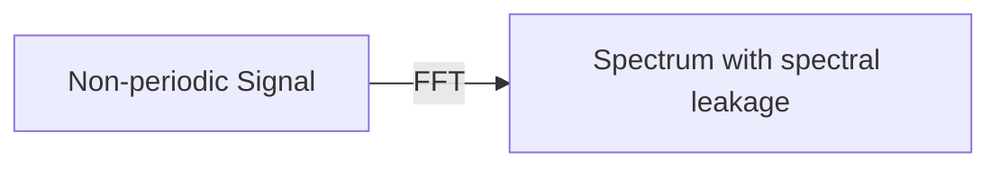
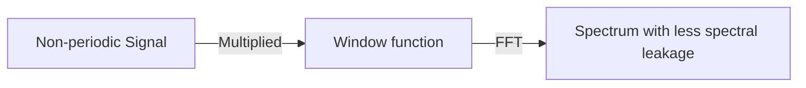

# Windowing

## What is Windowing

- Windowing is the process of taking a small subset of a larger dataset, for processing and analysis
- Windowing is accompished using a window fuction or a tapering function

## Why we need windowing

There are two types of FFT measurement 

Periodic Measurement

- Rare
- Captured signals are symmetric and can be appended to create a continuous infinite waveform
- FFT of periodic signal is **accurate**

Non-Periodic Measurement

- Usually, captured signal are fall into this cagatory
- Captured signals are is not symmetric
- Appending the signals would not produce the original continuous infinite waveform
- FFT of non-periodic signal is **misleading**

Spectral Leakage

- When a non-periodically signal is appended in the `time domain`, it produces **discontinuities**
- These discontinuities,which are short events in the time domain result in wide events in the `frequency domain`
- The wide spread in the frequency domain stemming from the original spectral line is the spectral leakage
- Spectral leakage is a consequence of non-periodic measurement
- Windowing functions are used to alleviate spectral leakage

## Window Function

### Definition

- A window funcion is a mathematical function that is zero valued outside of some chosen interval, symmetric around middle interval, having maximum value in the middle and tapers away from the middle.
- The main purpose of a window is to reduce the sharp discontinuities that occur when trying to append non-periodically measured signal
- There are different types of windows catered to specific signal processing requirements

### Process

Non periodically 
-> Signal multiplied by chosen window function 
-> Windowed signal than appended to create continuous waveform
-> Sharp edges are reduced due to windowing

- with out windowing

- with windowing

:::note
Convolving a window function with a signal sets the signal values before and after the window to zero, thereby preventing discontinuities caused by jumps when expanding the signal.
:::

### Window corrections

- Windowed signal does **NOT** exactly resemble the actual waveform
- There is a compromise on both **Amplitude** and **energy** of the original signal
- Corrections are available for each window type but both amplitude and energy corrections **CANNOT** be applied ant the same time
:::CAUTION
If you windowing a periodically captured signal，it would result in spectal leakage in the frequency domain.
:::

## Window Types

### Ideal Window

### Uniform/Rectangular Window

DEF:
- Unit amplitude for all time samples(not attenuate any part of the time data)
- Same as not applying any window

Best for 
- already periodic signals
- Transients, Bursts

### Hann/Hanning Window

DEF:
- Name comes form Julius von Hann
- Attenuate the input signal at both ends
- End points touch **Zero**

Pro:
- Eliminating all discontinuities
- Good frequency resolution
- Reduced spectral leakage

Cons:
- At the expense of amplitude accuracy
- Minor amplitude error occurs due to the shape

Best for
- Broband signals
- Noise

### Hamming Window

DEF:
- Name comes from Richard W Hamming
- End points does **NOT** touch zero

Pro:
- First side lobe of a Hann window is canceled

Cons:
- Spectral leakage is higher than Hann window
- Slight discontinuity in the convoluted signal

### Blackman Window

DEF:

### Chebyshev Window