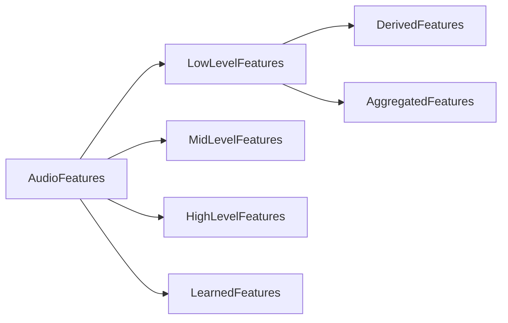
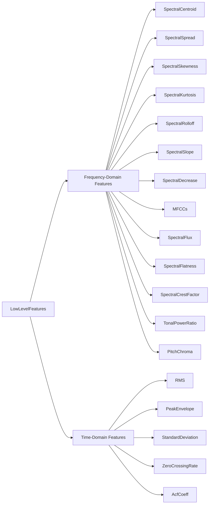

# Research on pyACA

## 0. What is pyACA?

pyACA is a python library built by [Alexanderlerch](https://github.com/alexanderlerch) for his book [An Introduction to Audio Content Analysis](https://www.audiocontentanalysis.org/) (hereinafter referred to as **ACA**).


## 1. What are Audio Features?

In ACA, audio features are divided into multiple categories:
Based on the level of abstraction of musicality, semantics, or perceptual meaning, they can be classified into:
- Low Level Features
- Mid Level Features
- High Level Features

Specifically, although there is no extremely strict formal boundary between mid-level and high-level features in academia, the general consensus is: the higher the level of the feature, the clearer the musical and perceptual meaning it represents.

1. Low-level / Instantaneous Features
    The low-level features of audio mainly represent the local physical and mathematical properties of the audio signal (such as the shape of the spectrum, energy fluctuations, etc.), and usually do not have direct musical, musicological, or human auditory perceptual meanings themselves.
    They are the most basic modules of audio content analysis, primarily used as "building blocks" to construct and infer more meaningful high-level features.
    Spectral Centroid, Zero Crossing Rate, and Root Mean Square (RMS) all belong to this category.

2. Mid-level Features
    Mid-level features have clear musical or acoustic perceptual properties, representing a specific dimension in music.
    An example of a mid-level feature explicitly pointed out in the book is the tempo of the music (Tempo).
    Other concepts such as Pitch, Beat, or Chord are also usually considered mid-level representations.

3. High-level Features
    High-level features represent highly abstract perceptual concepts and semantic tags used by humans when classifying music.
    These concepts are usually very complex and cannot be determined by a single physical property; instead, they need to comprehensively extract low/mid-level features from multiple dimensions such as timbre, tone, intensity, and time to be inferred.
    For example, Musical Genre
    and Mood / Affective Content of the music.

- The block diagram is as follows:

## 2. Classification of Low-level Features

Another term for low-level features in the book is Instantaneous Features, which are defined as being calculated based on segmented short-time audio blocks, with each block generating a corresponding numerical value (or vector).

Because this type of feature itself usually does not directly possess advanced meanings in music, musicology, or human auditory perception, they are collectively referred to as "low-level" features.

Low-level features should have the following properties (ACA p.40):
- High "discriminative" or descriptive ability, because the feature should be suitable for and relevant to the current task.
- Uncorrelated with other features, because each feature should provide new information to avoid redundancy.
- Invariance to irrelevant factors, to ensure that the feature is robust to the application of linear transformations on the input audio signal (such as scaling, low-pass filtering, reverberation), addition of (background) noise, coding artifacts, and non-linear operations (such as distortion and clipping).
- Reasonable computational complexity, to ensure that the feature can be computed on the target platform (such as mobile devices) and meet the requirements of the corresponding application.

## 3. Low-level Features in the Frequency Domain


:::NOTE
The book emphasizes that it is very difficult to find a strict classification that is simple, consistent, task-independent, and has no overlapping categories, so the book simply lists these features (p.41).

However, based on the code design of pyACA, we can clearly find that the author has divided low-level features into two major categories:
- **FetureSpectral**
- **FetureTime**

For the sake of narrative simplicity, I will also record low-level features according to this classification in the following text.
:::

- Block diagram


### 3.1 Spectral Centroid

1. What is it?

    Spectral Centroid is the center of mass of the spectral distribution.

2. What aspect of sound does it represent?

    Brightness
    Sharpness

3. How is it calculated?

    - Based on magnitude spectrum (standard algorithm)

    $$ 
    V_{SC}(n) = \frac{\sum_{k=0}^{K/2} k \cdot |X(k,n)|}{\sum_{k=0}^{K/2} |X(k,n)|} 
    $$ 

    - Based on power spectrum

    $$ 
    V_{SC}(n) = \frac{\sum_{k=0}^{K/2} k \cdot |X(k,n)|^2}{\sum_{k=0}^{K/2} |X(k,n)|^2} 
    $$ 

    - Logarithmic frequency scale (MPEG-7)

    $$ 
    V_{SC}(n) = \frac{\sum_{k=k(f_{min})}^{K/2} log_2\frac{f(k)}{f_{ref}} \cdot |X(k,n)|^2 }{\sum_{k=k(f_{min})}^{K/2} |X(k,n)|^2} 
    $$ 

4. What is the resulting output?

    - Bin Index

    $$0 \leq V_{SC}(n) \leq \Kappa/2$$

5. What are its applications?

    - Timbre description and classification 

    - Real-time audio effects 

    - Audio scene analysis and segmentation 

    - Speech/singing recognition 

:::Note
When there is no sound, note that the denominator cannot be 0.
:::

### 3.2 Spectral Spread (Bandwidth)

1. What is it?

    Spectral Spread measures the breadth of the spectral energy distribution. If the spectral centroid is the mean of this distribution, then the spectral spread can be directly regarded as the Standard Deviation of this distribution.
    
    It is also sometimes called the "instantaneous bandwidth" of the audio.

2. What aspect of sound does it represent?

    It primarily corresponds to human perception of "fullness" or "blurriness" of timbre:

    Low bandwidth: The sound's energy is highly concentrated at a few frequency points, sounding "pure", "sharp", or "sine-wave-like".

    High bandwidth: The sound's energy distribution is very broad, sounding "noisy", "raspy", "breathy", or "richly layered".
    
    For example:

    White noise: Has an extremely high spectral bandwidth.
    Pure tone (Sine Wave): Bandwidth is close to zero.
    Percussion (e.g., cymbals): Bandwidth is usually very high.

3. How is it calculated?

    - Standard algorithm

    $$
    V_{SS}(n) = \sqrt{\frac{\sum_{k=0}^{K/2} (k - V_{SC}(n))^2 \cdot |X(k,n)|}{\sum_{k=0}^{K/2} |X(k,n)|}}
    $$

    - Logarithmic scale (MPEG-7)

    $$
    V_{SS,log}(n) = \frac{\sum_{k=k(f_{min})}^{K/2} (log_2(\frac{f(k)}{f_{ref}}) - V_{SC}(n)) \cdot |X(k,n)|^2 }{\sum_{k=k(f_{min})}^{K/2} |X(k,n)|^2} 
    $$ 

4. What is the resulting output?

    - Bin Index

    $$0 \leq V_{SC}(n) \leq \Kappa/4 $$

5. What are its applications?

    - As a low-level feature input to classifiers

    - As foundational data for deriving higher-order features
:::Note
The result can be converted to specific Hz or normalized to a range of 0-1.
:::

### 3.3 Spectral Skewness

1. What is it?

    Spectral Skewness is derived based on the third-order central moment of the probability distribution. It is mainly used to measure the asymmetry of the spectral magnitude distribution around the spectral centroid.
    
2. What aspect of sound does it represent?

    Like centroid and spread, it belongs to the low-level frequency domain features describing audio, reflecting the skew tendency of the sound's spectral envelope shape.

3. How is it calculated?

    $$
    v_{SSk}(n) = \frac{\sum_{k=0}^{\mathcal{K}/2} (k - v_{SC}(n))^3 \cdot |X(k,n)|}{v_{SS}^3 \cdot \sum_{k=0}^{\mathcal{K}/2} |X(k,n)|}
    $$

   

4. What is the resulting output?

    - Value

    Equal to 0: Indicates the spectral distribution is perfectly symmetrical.

    Positive value (right-skewed): Indicates the center of gravity of the distribution is biased to the left (low frequencies), with a long tail on the right. Usually, signals with significant low-frequency energy will yield higher positive values.

    Negative value (left-skewed): Indicates the center of gravity of the distribution is biased to the right, with a long tail on the left.

    Values close to 0: For broadband noise signals, since the energy distribution is relatively uniform/random, the skewness usually drops to near 0.


5. What are its applications?

    As a supplementary feature describing the shape of the audio frequency domain, it provides machine learning models with information about the bias of sound energy concentration. Statistically, skewness can also serve as a quick method to test whether the distribution of an audio feature is close to a Gaussian (normal) distribution (the skewness of a Gaussian distribution is 0).

:::Note
:::

### 3.4 Spectral Kurtosis

1. What is it?

    Spectral Kurtosis is derived based on the fourth-order central moment of the probability distribution.
    It measures the "non-Gaussianity" of the spectral distribution. Specifically, it reflects whether the spectral distribution is flatter or sharper (peaked) compared to a standard Gaussian distribution.

2. What aspect of sound does it represent?

    It is also a low-level feature that describes timbre and spectral envelope shape.
    It captures whether the sound spectrum contains extremely prominent single frequency components (such as clear overtones) or is a flat sound lacking prominent frequency components.

3. How is it calculated?

    $$
    v_{SK}(n) = \frac{\sum_{k=0}^{\mathcal{K}/2} (k - v_{SC}(n))^4 \cdot |X(k,n)|}{v_{SS}^4 \cdot \sum_{k=0}^{\mathcal{K}/2} |X(k,n)|} - 3
    $$

4. What is the resulting output?

    - Value

    Equal to 0 (mesokurtic): Indicates the shape of the spectral distribution is similar to a standard Gaussian distribution.

    Positive value (leptokurtic): Indicates the presence of very sharp peaks in the spectrum. For example, during a clearly played note by an instrument (like a saxophone), since the energy is highly concentrated at the fundamental frequency and a few harmonics, a high positive value is obtained.

    Negative value (platykurtic): Indicates the spectral distribution is flatter and broader than a Gaussian distribution. During music pauses or periods filled with background noise, due to the lack of prominent tonal peaks, this value will drop significantly.

5. What are its applications?

    Spectral kurtosis is typically used in combination with features like skewness for classifiers to identify specific instruments or audio textures (such as distinguishing obvious tonal signals from broadband noise). Furthermore, in statistical evaluations, it can also be used to measure the flatness/sharpness of the data distribution, assisting in judging whether the feature fits the Gaussian distribution assumption.

:::Note
    
:::

### 3.5 Spectral Rolloff

1. What is it?

    Spectral Rolloff is used to measure the bandwidth of an audio data block.

2. What aspect of sound does it represent?

    It describes the energy distribution range and effective bandwidth of a sound data block.

        Low values: Indicate weak high-frequency components and a low effective bandwidth of the sound. For example, while a monophonic instrument (like a saxophone) clearly plays a note, the value of this feature is usually relatively low and stable.
        High values: Indicate sufficient high-frequency energy and a wide sound bandwidth. For example, during a music pause or a period filled with broadband background noise, because the noise is widely distributed, its value will rise significantly, often showing irregular and drastic fluctuations.

3. How is it calculated?

    Its core logic is to find a "cutoff frequency": the sum of all spectral energy below this frequency exactly reaches a certain percentage κ of the total spectral energy of that audio frame (the most commonly used κ values are 85% or 95%).

    Global Spectral Rolloff 

    $$
    v_{SR}(n) = k_r \quad \text{满足} \quad \sum_{k=0}^{k_r} |X(k,n)| = \kappa \cdot \sum_{k=0}^{\mathcal{K}/2} |X(k,n)|
    $$

    Constrained-range Spectral Rolloff (common in practical applications)

    $$
    v_{SR,\Delta f} (n) = k_r \quad \text{满足} \quad \sum_{k=k(f_{min})}^{k_r} |X(k,n)| = \kappa \cdot \sum_{k=k(f_{min})}^{k(f_{max})} |X(k,n)|
    $$

    Extremely low or high frequency components are usually considered unnecessary or unwanted noise interference. For example, extremely low frequencies may only contain environmental noise or hum from recording equipment. If the first global formula is used, these useless extreme frequency energies will interfere with the actual bandwidth measurement of the true signal. Therefore, the second formula, by setting clear start and end boundaries, allows the system to exclude interference from extreme frequency bands and only find the boundary of energy decay within a truly useful or perceptually meaningful frequency range.

4. What is the resulting output?

    - Bin Index

    $$
    0 \leq V_{SR}(n) \leq \Kappa/2 
    $$

5. What are its applications?

    As a very intuitive way to measure bandwidth, it is often used as a low-level feature input for audio content analysis systems. With it, high-bandwidth noise/percussive signals can be quickly distinguished from low-bandwidth pure tone/harmonic signals.
    Combined with features like Centroid and Skewness, it can provide machine learning models (such as speech/music classifiers, music genre classifiers, etc.) with critical boundary information regarding the limits of the sound's spectral distribution.

:::Note
Like the previously mentioned frequency-domain features, Spectral Rolloff is mathematically undefined when a completely silent frame is input. In actual code, exception handling is needed to prevent errors.
:::

### 3.6 Spectral Decrease

1. What is it?

    Spectral Decrease is a low-level feature used to estimate the steepness of the spectral envelope's descent over frequency.

2. What aspect of sound does it represent?

    It quantifies whether energy is concentrated in very low frequency bands and the severity of the decay of high-frequency components as frequency increases.

3. How is it calculated?

    Its calculation method is to compute the difference between the magnitude of each frequency bin and the magnitude of the 0th frequency bin (usually representing the DC component or extremely low-frequency components), multiply by the weight of the reciprocal of that frequency bin's index (1/k), and sum them up. Finally, it is normalized by dividing by the sum of all frequency magnitudes except the 0th bin.

    $$
    v_{SD}(n) = \frac{\sum_{k=1}^{\mathcal{K}/2} \frac{1}{k} \cdot (|X(k,n)| - |X(0,n)|)}{\sum_{k=1}^{\mathcal{K}/2} |X(k,n)|}
    $$

4. What is the resulting output?

    - Value

    The calculated result is a value satisfying $$ V_{SD}(n) \leq 1 $$.
    
Physical meaning: Lower values indicate that the spectral energy is highly concentrated in the lowest frequency bands (i.e., near bin 0).

5. What are its applications?

    Although theoretically designed to describe the downward trend of the spectral envelope, in practical engineering and observation, the author found it very difficult to draw any useful conclusions from its dynamic curve.
    Especially during music pauses or silent periods filled with background noise, the value of this feature will show extremely irregular and drastic fluctuations.
    Precisely because of its poor interpretability and susceptibility to fluctuation, the book explicitly points out: this feature is not commonly used in practical audio analysis systems.
:::Note
    
:::

### 3.7 Spectral Slope

1. What is it?

    Spectral Slope, similar to Spectral Decrease, is a feature used to measure the degree of tilt in the spectral shape.
    It is derived by calculating a linear approximation of the magnitude spectrum. Specifically, the magnitude spectrum is treated as a linear function of frequency, and a **linear regression** method is used to estimate the slope of this fitted line.

2. What aspect of sound does it represent?

    It intuitively reflects the overall linear descending (or ascending) trend of the audio signal's energy as the frequency increases.

3. How is it calculated?

    Linear regression formula

    $$ 
    \hat{y}(n) = m \cdot v(n) + c
    $$

    Slope formula

    $$
    m = \frac{\sum_{r=0}^{\mathcal{R}-1} (y(r) - \mu_y) \cdot (v(r) - \mu_v)}{\sum_{r=0}^{\mathcal{R}-1} (v(r) - \mu_v)^2} 
    $$

    Spectral Slope

    $$
    v_{SSl}(n) = \frac{\sum_{k=0}^{\mathcal{K}/2} (k - \mu_k)(|X(k,n)| - \mu_{|X|})}{\sum_{k=0}^{\mathcal{K}/2} (k - \mu_k)^2}
    $$


4. What is the resulting output?

    - Range depends on the amplitude range of the spectral magnitudes, and there is no fixed boundary.

5. What are its applications?

    Spectral Slope can help audio content analysis systems (such as instrument recognition, speech/music classification, etc.) distinguish between musical tone signals with strong and rich overtone sequences (extremely negative slope) and broadband noise signals with uniform spectral distribution (flat slope).

:::Note
    
:::

### 3.8 MFCCs (Mel Frequency Cepstral Coefficients)

1. What is it?

    MFCC (Mel Frequency Cepstral Coefficients) is a compact description of the spectral envelope shape of an audio signal.
    It is a set of feature coefficients derived by combining the non-linear perception rules of human hearing towards frequencies (Mel scale) and Cepstral analysis technology.

2. What aspect of sound does it represent?

    The Mel-warping of the spectrum often leads people to consider MFCCs as "perceptual" features. This is only partially true, because there is no psychoacoustic evidence supporting the application of DCT. Furthermore, there is no direct correlation between MFCCs and known perceptual dimensions.

3. How is it calculated?

    - Cepstrum

        $$
        cx(i) = \mathcal{F}^{-1}\{\log(X(j\omega))\}
        $$

    - MFCCs

        $$
        v^j_{MFCC}(n) = \sum_{k'=1}^{\mathcal{K}'} \log(|X_{warp}(k',n)|) \cdot \cos \left( j \cdot \left( k' - \frac{1}{2} \right) \frac{\pi}{\mathcal{K}'} \right)
        $$

    - Process
```mermaid
graph TD;
    A(["Input: Magnitude Spectrum of Audio Block |X(k,n)|"]) --> B[Apply Mel Filterbank]
    B --> C(["Mel-warped Spectrum"])
    C --> D[Logarithm]
    D --> E(["Log-Mel Spectrum"])
    E --> F[DCT (Discrete Cosine Transform)]
    F --> G(["Full MFCCs"])
    G --> H[Feature Truncation and Processing: <br/> Retain low-order coefficients, <br/> usually discard the 0th coefficient]
    H --> I(["Output: Final MFCC Feature Vector"])
    classDef process fill:Blue,stroke:#333,stroke-width:2px;
    classDef data fill:black,stroke:#0288d1,stroke-width:2px;
    
    class A,C,E,G,I data;
    class B,D,F,H process;
```

4. What is the resulting output?

    Calculating MFCCs for a complete segment of an audio signal yields a two-dimensional array (2D matrix).
    The two dimensions of this 2D array represent the sound feature dimension and the time dimension, respectively:

        1. First dimension:
        Represents the order of the MFCC coefficients (index j).
        Each row of the array corresponds to an MFCC coefficient curve of a specific order.

        2. Second dimension:
        Represents the index of the audio data block / time frame (index n).
        MFCC extraction is performed frame-by-frame, and each column of the array represents a set of MFCC feature values extracted from the audio within a specific STFT segment (frame).

5. What are its applications?

    Since their introduction in 1980, MFCCs have been widely used in the field of speech signal processing and have been proven to be equally applicable to music signal processing applications. In the field of audio signal classification, studies have shown that a small subset of the generated MFCCs already contains the main information (in most cases, the number of MFCCs used is between 4 and 20).
    Today, MFCCs are probably the most commonly used audio feature in baseline systems, because they have proven to be robust and practical across a wide range of tasks. This computation method is closely related to cepstrum computation, as it is the result of applying a logarithmic transformation to a spectral representation. Its main differences from standard cepstrum are: the adoption of a warped non-linear frequency scale (Mel scale, see Section 7.1.1) to model human non-linear perception of frequencies, and the use of the Discrete Cosine Transform (DCT) instead of the Discrete Fourier Transform (DFT).

:::Note
Although MFCC is one of the most successful features in audio analysis, it has limitations in "interpretability":

    1. Lack of intuitive physical meaning:
    Although they have proven to be extremely useful in engineering, it is difficult for us to find a nontrivial, intuitive correspondence between these coefficients and the input audio signal.
    In other words, apart from the fact that the 0th coefficient represents energy, we cannot directly point out which perceptual dimension of human hearing the 2nd or 3rd coefficient specifically represents, like we can explain "spectral centroid represents brightness".
    2. Not a purely perceptual feature:
    While the "Mel scale" in the calculation process is based on human auditory perception, there is no psychoacoustic evidence to directly prove that the "Discrete Cosine Transform (DCT)" step matches the human auditory mechanism.

Therefore, one cannot simply view this set of coefficients as equivalent to human auditory perceptual features.
:::

### 3.9 Spectral Flux

1. What is it?

    Spectral Flux is a feature used to measure the amount of change in the spectral shape over time; spectral flux is specifically used to measure the degree of dynamic change in a spectrum.

2. What aspect of sound does it represent?

    It reflects the intensity of the spectral fluctuations of the audio signal between adjacent time frames.
    In auditory perception, the book points out that such quasi-periodic variations or modulation of excitation patterns at the spectral level are somewhat associated with the human auditory perceptual experience of sound's **roughness**.

3. How is it calculated?

    Its core calculation logic is to find the average difference between the Short-Time Fourier Transform (STFT) magnitude spectra of two adjacent frames. Usually, this is achieved by computing the **Euclidean distance** between the spectra of these two frames.

    - Generalized formula

    $$
    v_{SF}(n, \beta) = \frac{\sqrt[\beta]{\sum_{k=0}^{\mathcal{K}/2} \left| |X(k,n)| - |X(k,n-1)| \right|^\beta}}{\mathcal{K}/2 + 1}
    $$

    In this generalized formula, the parameter β determines the Distance Norm used when computing the difference between adjacent spectral frames.
    Normally, the value of β ranges between [0.25, 3].
    The application of Euclidean distance and Manhattan distance here:
    1. Euclidean Distance (corresponding to β=2)
    - When β=2, the above generalized formula degenerates into the most standard spectral flux formula.
    At this time, the system is calculating the straight-line distance in a multidimensional space between two adjacent frame spectra, i.e., the L2 Norm.
    - In the formula, it squares the magnitude difference of each frequency bin, sums them up, and then takes the square root.
    - Because the squaring operation is employed, the Euclidean distance will significantly amplify (penalize) those frequency bins with large differences. This means that if a drastic energy mutation occurs in a specific frequency band of the sound (such as the strong onset of a certain note), this distance metric will rise rapidly, making it very sensitive to extreme fluctuations in the spectrum.
    2. Manhattan Distance (corresponding to β=1)
    - When β=1, the squaring and square root operations in the formula are canceled out, and the system calculates the sum of the absolute errors between the spectral features of two adjacent frames, i.e., the L1 Norm (or City Block distance).
    - At this time, the formula is equivalent to directly calculating the sum of the absolute values of the magnitude differences for all frequency bins, and finally dividing by the total number of frequency bins for normalization.
    - Compared to the Euclidean distance, the Manhattan distance linearly accumulates the differences across all frequency bins. It does not overly amplify drastic changes in a single frequency band, but treats tiny or huge differences everywhere in the spectrum equally. This characteristic allows it to show different dynamic smoothness from the Euclidean distance when processing audio containing large amounts of tiny noise fluctuations.

4. What is the resulting output?

    - Value

    The calculated result is a value satisfying $$ V_{SD}(n) \leq A $$.

    $$A$$ depends on the normalization method of the signal and the maximum range of the spectral magnitude.

    - Low values:
    When the sound is in a stable sustained phase (like smoothly blowing a note) or in a silent pause with low background noise, the feature value will be very low.
    - High values:
    When the pitch of the sound changes, or at the exact moment a new note starts being played (i.e., when transients are present), the value will form obvious peaks.

5. What are its applications?

    The core application of Spectral Flux is its use as a **Novelty Function in Onset Detection systems**.

:::Note
    
:::

### 3.10 Spectral Crest Factor

1. What is it?

    Spectral Crest Factor is a low-level feature used to estimate how "sine-wave-like" a spectrum is.

2. What aspect of sound does it represent?

    It is a simple measurement method used to gauge the **Tonalness** of a sound. It is primarily used to roughly evaluate the proportional distribution between "musical tone (Tonal) components with definite pitch" and "broadband noise (Noisy) components" in a signal.

3. How is it calculated?

    Extract the Maximum value from the magnitude spectrum of the current analysis block, and divide it by the Sum of the magnitudes of all frequency bins in that magnitude spectrum.

    $$
    v_{Tsc}(n) = \frac{\max_{0 \le k \le \mathcal{K}/2} |X(k,n)|}{\sum_{k=0}^{\mathcal{K}/2} |X(k,n)|}
    $$

    In some algorithmic implementations, instead of using the "sum" of all magnitudes for the denominator, the **Arithmetic mean** of the magnitude spectrum is used for normalization.

4. What is the resulting output?

    Results calculated using the standard formula fall between $$  \frac{2} {K+2} \leq V_{T_{SC}}(n) \leq 1   $$ (where K is the number of samples in the audio data block).

    If the variant formula using the arithmetic mean as the denominator is adopted, its result range is scaled to $$ 1 \leq V_{T_{SC}} \leq \frac{K+2}{2} $$.


5. What are its applications?

    As an intuitive feature for measuring tonalness, it is often used to distinguish musical/harmonic components from noise/percussive components in audio.
    In machine learning systems, it can provide critical clues regarding the concentration of spectral energy for audio content analysis (like speech vs. music classification, instrument recognition, or audio segmentation).

:::Note
    
:::

### 3.11 Spectral Flatness

1. What is it?

    Spectral Flatness is a low-level frequency domain feature that measures the shape of the spectral distribution; its essence is the ratio between the **Geometric mean** and the **Arithmetic mean** of the magnitude spectrum.

2. What aspect of sound does it represent?

    It represents the degree of flatness of a sound.
    Contrary to the previously introduced Spectral Crest Factor, which measures "tonalness," Spectral Flatness is used to evaluate whether the spectral energy is evenly distributed (white noise) or concentrated in a few frequency bands (musical tones).

3. How is it calculated?

    Its core calculation logic is dividing the geometric mean of the spectrum by the arithmetic mean.
    In practical engineering, to avoid numerical overflow and precision issues caused by continuous multiplication, the geometric mean in the numerator is usually approximated by "taking the exponent of the arithmetic mean of the log magnitude spectrum."

    $$
    v_{Tf}(n) = \frac{\sqrt[\mathcal{K}/2]{\prod_{k=0}^{\mathcal{K}/2-1} |X(k,n)|}}{\frac{2}{\mathcal{K}} \sum_{k=0}^{\mathcal{K}/2-1} |X(k,n)|} = \frac{\exp \left( \frac{2}{\mathcal{K}} \sum_{k=0}^{\mathcal{K}/2-1} \log(|X(k,n)|) \right)}{\frac{2}{\mathcal{K}} \sum_{k=0}^{\mathcal{K}/2-1} |X(k,n)|}
    $$


4. What is the resulting output?

    -Value

    The calculated result is a value greater than 0, and its specific upper limit depends on the maximum amplitude range of the spectral magnitudes.

5. What are its applications?

    It is often used as a key indicator to distinguish noise components from musical tone components in sound.
    In actual advanced audio analysis systems (such as the MPEG-7 standard), to obtain more detailed and useful information, a single global flatness over the entire spectrum is usually not calculated.
    Instead, the system often divides the frequency range of interest (e.g., 250 Hz to 16 kHz) into multiple overlapping frequency bands (e.g., 24 quarter-octave bands), and then computes the flatness independently within each subband, thereby providing a multi-dimensional set of feature vectors for machine learning models.
:::Note
    
:::

### 3.12 Spectral Tonal Power Ratio

1. What is it?

    Tonal Power Ratio is a low-level feature used to compute and evaluate the "Tonalness" of a spectrum.
    Its core idea is to calculate the ratio between the "power of tonal components" and the "total overall spectral power" in a spectrum.

2. What aspect of sound does it represent?

    It represents the Tonalness of the sound.
    Similar to the previously introduced Spectral Crest Factor, it is used to evaluate the proportional relationship between musical tone components with clear pitch and broadband noise components without clear pitch in an audio signal.

3. How is it calculated?

    The key to its computation lies in how to estimate the "tonal power" ($$ E_T(n) $$). A simple estimation method given in the book is: find frequency bins in the power spectrum that meet the following two conditions, and add their powers together as $$ E_T(n) $$. It must meet two conditions:

    1. It must be a Local maximum, meaning it satisfies:

    $$
    ∣X(k−1,n) ∣^2 \leq ∣ X(k,n) ∣^2 \geq ∣X(k+1,n) ∣^2 
    $$

    2. Its power must be greater than a preset threshold $$ G_T $$.
    $$ G_T $$ must be set high enough to block out random background noise spikes, but low enough to ensure it captures the higher harmonics of musical tones.

    Finally, divide the estimated tonal power by the sum of the squared frequency magnitudes (i.e., total power) of all bins in the current block.

    The formula is as follows:

    $$
    v_{Tpr}(n) = \frac{E_T(n)}{\sum_{k=0}^{\mathcal{K}/2} |X(k,n)|^2}
    $$

4. What is the resulting output?

    The calculated result is a value falling between $$ 0 \leq V_{Tpr}(n) \leq 1 $$.

    Low values: Suggest a flat spectral distribution (noise-like) or extremely low input levels.
    During music pauses/silences filled with background noise, its value approaches 0; while at the moment a note starts being played (transients), this value also shows a noticeable drop.
    High values: Indicate that the spectrum possesses strong tonal characteristics, usually appearing in passages of stable musical tone playing.


5. What are its applications?

    As a reliable tonalness detector.

:::Note
In the MATLAB source code provided by the book, 'findpeaks' is used to find all local maxima, followed by the condition 'find(afPeaks > G_T)' to forcefully eliminate "false peaks" whose power is lower than G_T.
:::

## 4. Low-level Features in the Time Domain

### 4.1 Time Maximum of Autocorrelation Function

1. What is it?

    The Autocorrelation Function Maximum (ACF Maximum) is an audio feature typically extracted in the time domain. It calculates the Autocorrelation Function (ACF) of a time signal and finds its global maximum absolute value to represent the characteristics of the signal.

2. What aspect of sound does it represent?

    It represents the Tonalness and Periodicity of the audio signal.
    The autocorrelation function produces local maxima when the lag matches the inherent periodic wavelength of the signal.
    The less periodic a signal is (i.e., the more it lacks a clear tone), the lower these maxima will be.
    Therefore, extracting the global maximum absolute value of the autocorrelation function can serve as a simple metric to estimate the strength of the signal's tonalness.

3. How is it calculated?

    The core is to find the maximum value of the autocorrelation function $$|r_{xx}(\eta,n)|$$ within the current block.

    Excluding Main Lobe interference:
    Because the autocorrelation function inevitably has a maximum main lobe near the lag η=0 (at this point, the signal completely overlaps with its unshifted self), to obtain meaningful results, the values within the main lobe must be ignored.

    Setting the search starting point $$ {\eta}_{start} $$:
    In actual calculations, certain strategies must be used to set the lag of the search starting point $$ {\eta}_{start} $$. For example: setting a minimum lag determined by the highest expected frequency, finding the minimum magnitude position where the function drops below a preset threshold, or starting the search only after the first local minimum.

    The book introduces three viable strategies:

    1. Minimum lag

        This is a fixed cutoff method based on frequency ranges. Its premise assumes that the maximum value we are interested in will not appear at extremely high frequencies (because high frequencies correspond to extremely small lags and period lengths).
        Therefore, the system can directly set a predefined minimum lag and ignore all lag values smaller than it.
        The lower the expected highest frequency, the larger this minimum lag can be set.
        For instance, at a 48 kHz sampling rate, if the expected highest frequency is 1920 Hz, the minimum lag can be set to 25 samples.
    
    2. Minimum magnitude threshold

        This is a dynamic setting method based on a threshold. It sets the search starting point $$ {\eta}_{start} $$ to the minimum lag when the autocorrelation function $$ r_{xx} $$ first drops below (or crosses) a certain preset threshold $$ G_r $$.
        In other words, as the autocorrelation function starts decreasing from the maximum at η=0, the system only considers it has moved out of the main lobe's range when its value falls below a "safe line," and then begins searching for the maximum.

    3. Search range from the first local minimum

        This is a setting method based on curve morphology. Its rule is: only consider peaks whose lag is greater than the position of the "first" local minimum.
        The core idea of this design is to use the first "valley" of the function curve as a natural boundary for the end of the main lobe, thus avoiding mistakenly treating meaningless local maxima on the main lobe near η=0 as true periodic peaks.
        However, the book also warns that for certain specific signals, the local minimum might appear at very short lag positions.

    In practical engineering applications, to ensure reliability to the greatest extent, these methods are usually combined and applied with constraint conditions for specific problems to set the search starting point $$ {\eta}_{start} $$.
    

4. What is the resulting output?

    - Value

    The calculated result is a value satisfying $$ 0 \leq V_{Ta}(n) \leq 1 $$.   

    Low values:
    Indicate that the audio segment is a nonperiodic signal.
    For example, in pause/silent segments filled with broadband noise, the feature value often sits at a low level.

    High values:
    Indicate that the signal possesses strong periodicity (periodic signal).
    For example, when an instrument is steadily playing a musical tone (tonal segments), this feature will exhibit a high and stable value.

5. What are its applications?

    As a tool to measure periodicity and tonalness, ACF-based features are best suited for monophonic signals,
    or polyphonic signals containing very few fundamental frequencies.
    
    Besides using its absolute value directly as a "tonalness" feature, the exact lag position where the autocorrelation function maximum is located corresponds to the fundamental period of the sound.
    Therefore, it is one of the commonly used methods in **fundamental frequency detection** and **pitch tracking** systems.

:::Note
    
:::


### 4.2 Time Zero Crossing Rate

1. What is it?

    Zero Crossing Rate is a low-level time-domain feature that has been widely applied in speech and audio analysis for decades due to its extreme computational simplicity.
    
    Its core concept is to count the number of times the amplitude of an audio signal changes sign (i.e., alternates between positive and negative levels, crossing the zero point) in consecutive audio data blocks.

2. What aspect of sound does it represent?

    It mainly represents the Noisiness of a sound, that is, the amount of high-frequency content.
    
    At the same time, it can inversely reflect the Periodicity of the signal: the greater the variation of the zero crossing rate between different data blocks, the weaker the signal's periodicity.

3. How is it calculated?

    Its computation logic is to iterate through every sample in the current data block, calculate the absolute difference between its sign and the sign of the previous sample, sum them up, and normalize.
    
    An important prerequisite for the calculation is assuming the arithmetic mean of the input signal is approximately 0 (i.e., no DC offset).

    $$
    v_{ZC}(n) = \frac{1}{2 \cdot \mathcal{K}} \sum_{i=i_s(n)}^{i_e(n)} |\text{sign}[x(i)] - \text{sign}[x(i - 1)]|
    $$

    The definition of the Sign function is as follows:

    $$
    \text{sign}[x(i)] = 
    \begin{cases} 
    1, & \text{if } x(i) > 0 \\ 
    0, & \text{if } x(i) = 0 \\ 
    -1, & \text{if } x(i) < 0 
    \end{cases}
    $$

4. What is the resulting output?


    - Value

    The calculated result is a value satisfying $$ 0 \leq V_{ZC}(n) \leq 1 $$.   

    High values:
    Indicate that the signal contains more noise or high-frequency components; for example, in segments filled with broadband noise, the feature value is often high.

    Low values and long constants:
    In musical tone playing passages with stable pitch (tonal parts), the zero crossing rate will be very low, and it will exhibit a constant, unchanging value for a long period while the pitch remains stable.

   

5. What are its applications?

    As one of the most basic time-domain features, it is frequently used in combination with features like RMS (Root Mean Square) and Spectral Centroid for early low-level audio content analysis tasks (such as distinguishing speech and music, or evaluating the noise level of a signal).

:::Note
    
:::

### 4.3 Time STD (Standard Deviation)

1. What is it?

    Standard Deviation is a statistical measurement indicator used to measure the spread of a distribution of an input signal (or feature sequence) around its arithmetic mean.

2. What aspect of sound does it represent?

    It represents the dynamic fluctuation amplitude of the signal. In the context of an audio waveform, if the signal has no DC offset (i.e., the mean is 0),
    the standard deviation is completely equivalent to the alternating current (AC) energy or Root Mean Square (RMS) of the signal.

    In the feature aggregation stage, it represents how drastically a specific audio feature changes over a period of time.

3. How is it calculated?

    The calculation method is to first find the Variance, which is the average of the squared differences between each sample value and the mean $$ {\mu}_v $$, and then take the square root of it.

    $$
    \sigma_v = \sqrt{\frac{1}{\mathcal{N}} \sum_{n=0}^{\mathcal{N}-1} (v(n) - \mu_v)^2}
    $$

4. What is the resulting output?


    - Value

    The calculated result is a value satisfying $$ 0 \leq {\sigma}_v \leq max(|v(n)|) $$.   

    For completely silent or constant invariant signals, the standard deviation is 0. 
    
    The more drastically the signal fluctuates, the larger the standard deviation. It is relatively sensitive to asymmetrical distributions.

5. What are its applications?

    Feature Aggregation
    Feature Normalization

:::Note
    
:::

### 4.4 Time RMS (Root Mean Square)

1. What is it?

    Root Mean Square (RMS) is one of the most commonly used low-level Intensity features, sometimes directly referred to as "sound intensity" in audio engineering.

2. What aspect of sound does it represent?

    It represents an objective measure of the **Power** or overall Loudness of an audio signal within a specific time block.

    Because it has a certain integration time (usually several hundred milliseconds), it reflects the sustained energy of the sound.

    In the feature aggregation stage, it represents how drastically a specific audio feature changes over a period of time.

3. How is it calculated?

    By computing the average of the squares of all audio sample values within a data block, and then taking the square root.

    $$
    v_{RMS}(n) = \sqrt{\frac{1}{\mathcal{K}} \sum_{i=i_s(n)}^{i_e(n)} x(i)^2}
    $$

4. What is the resulting output?


    - Value

    If the amplitude of the input waveform is normalized to [−1,1], the result is $$ 0 \leq V_{RMS}(n) \leq 1 $$.    

    - The result is 0 when completely silent;
    
    - For a square wave with maximum amplitude or a constant DC offset, the result approaches 1;
    
    - In practical applications, RMS is usually converted to decibels (dBFS) for display;
    
    - Compared to peak envelope, RMS smooths out extremely short transient spikes in the signal.
   
5. What are its applications?

    - Loudness/dynamics estimation

    - Audio preprocessing and alignment

    - Genre and speech recognition

:::Note
    
:::

### 4.5 Time Peak Envelope

1. What is it?

    Peak Envelope is a time-domain feature used to describe the amplitude contour of an audio signal. It is specifically used to capture the short-term maximum amplitude (extremum) of the audio waveform.

2. What aspect of sound does it represent?

    Unlike RMS, which represents "average energy," the peak envelope represents the sound's **transient peak level** and fast fluctuations.

    It is highly sensitive to extremely short dynamic changes, such as the moment of percussion strikes or the sudden onset of notes.

3. How is it calculated?

    The mathematical method for extracting the peak envelope is finding the sample with the maximum absolute value in each audio data block.

    $$
    v_{Peak}(n) = \max_{i_s(n) \le i \le i_e(n)} |x(i)|
    $$  


4. What is the resulting output?


    - Value

    If the amplitude of the input waveform is normalized to [−1,1], the result is $$ 0 \leq V_{Peak}(n) \leq 1 $$. It can also be converted to decibel (dBFS) output.  

    Compared to RMS, the peak envelope shows faster and more pronounced changes.

    It forms sharp spikes immediately upon encountering percussive strikes, while it drops significantly during music pauses.

5. What are its applications?

    Overload/clipping detection

    Onset detection

:::Note
One of the principles of PPM (Peak Program Meter) :-)    
:::