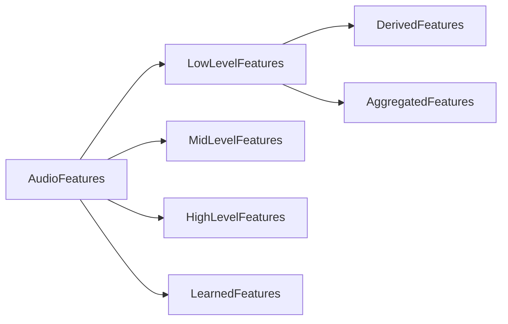
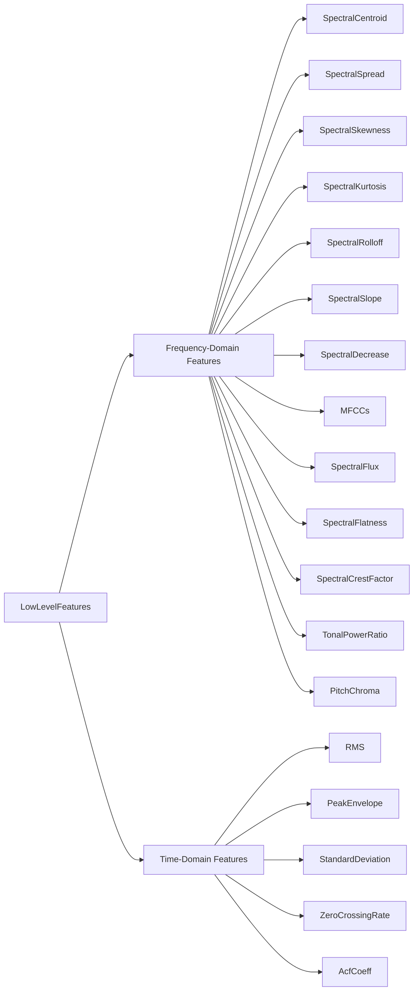
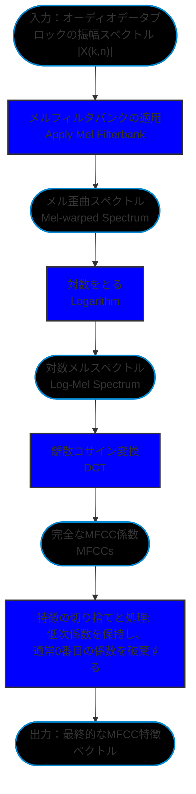

# pyACAに関連する研究

## 0. pyACAとは何か

pyACAは[Alexanderlerch](https://github.com/alexanderlerch)が彼の著書[An Introduction to Audio Content Analysis](https://www.audiocontentanalysis.org/)(以下**ACA**と略称)のために構築したPythonライブラリです

## 1. 音声の特徴とは何か

ACAでは、オーディオ特徴量(音声の特徴)を複数のカテゴリに分類しています:
音楽的、意味的、または知覚的な意味の抽象度に基づいて、以下のように分類できます:
- 低レベル特徴量(Low Level Features)
- 中レベル特徴量(Mid Level Features)
- 高レベル特徴量(High Level Features)

具体的には、学術界において中レベルと高レベルの特徴量の間に厳密な境界線はありませんが、一般的な合意として、特徴量のレベルが高いほど、それが表す音楽的および知覚的な意味がより明確になります。

1. 低レベル特徴量（Low-level / Instantaneous Features）
    オーディオの低レベル特徴量は、主にオーディオ信号の局所的な物理的および数学的属性（スペクトルの形状、エネルギーの変動など）を表し、通常はそれ自体に直接的な音楽的、音楽学的、または人間の聴覚知覚上の意味はありません。
    これらはオーディオコンテンツ分析の最も基本的なモジュールであり、主により意味のある高レベル特徴量を構築および推論するための「ビルディングブロック」として使用されます。
    スペクトル重心（Spectral Centroid）、ゼロ交差率（Zero Crossing Rate）、二乗平均平方根（RMS）などがこのカテゴリに属します。

2. 中レベル特徴量（Mid-level Features）
    中レベル特徴量は明確な音楽的または音響的知覚属性を持ち、音楽における特定の次元を表します。
    本で明示されている中レベル特徴量の例は、音楽のテンポ（Tempo）です。
    その他にも、ピッチ（Pitch）、ビート（Beat）、コード（Chord）などの概念も通常、中レベルの表現と見なされます。

3. 高レベル特徴量（High-level Features）
    高レベル特徴量は、人間が音楽を分類する際に使用する高度に抽象的な知覚的概念とセマンティックタグを表します。
    これらの概念は通常非常に複雑で、単一の物理的属性では決定できず、音色、音調、強度、時間などの複数の次元の低・中レベル特徴量を総合的に抽出して推論する必要があります。
    例えば、音楽ジャンル（Musical Genre）
    および音楽の感情/ムードコンテンツ（Mood / Affective Content）などがあります。

-ブロック図は以下の通りです

## 2. 低レベル特徴量の分類

本における低レベル特徴量の別の呼び方は、瞬時特徴量(Instantaneous Features)です。その定義は、分割された短いオーディオデータブロック（block）に基づいて計算され、各データブロックが対応する数値（またはベクトル）を生成するというものです。

これらの特徴量自体は通常、明確な音楽的、音楽学的、または人間の聴覚知覚上の高度な意味を直接持たないため、「低レベル」特徴量と総称されます。

低レベル特徴量は以下の属性を持つべきです(ACA p.40)
- 適切で現在のタスクに関連している必要があるため、高い「識別」または記述能力を持つ。
- 重長を避けるために各特徴量が新しい情報を提供すべきであるため、他の特徴量と相関しない。
- オーディオ信号に対する線形変換（スケーリング、ローパスフィルタリング、リバーブなど）、（背景）ノイズの追加、コーディングアーティファクト、および非線形操作（歪みやクリッピングなど）の適用に耐えられるよう、無関係な要因に対する不変性を持つ。
- 対象プラットフォーム（モバイルデバイスなど）で計算可能であり、対応するアプリケーションの要件を満たすための妥当な計算複雑性を持つ。

## 3. 周波数領域の低レベル特徴量

:::NOTE
本では、シンプルで一貫性があり、特定のタスクに依存せず、カテゴリの重複がない厳密な分類を見つけるのは非常に困難であると強調されています。そのため、本ではこれらの特徴量を単に列挙しているだけです(p.41)

しかし、pyACAのコード設計に基づくと、著者が低レベル特徴量を2つの大きなカテゴリに分けていることが明確にわかります:
- **FetureSpectral**
- **FetureTime**

説明を簡潔にするため、以降もこの分類に従って低レベル特徴量を記述します。
:::

- ブロック図

### 3.1 Spectral Centroid

1. とは何か

    スペクトル重心(Spectral Centroid)は、スペクトル分布の重心です。

2. 音声のどのような側面を表すか

    明るさ(Brightness)
    鋭さ(Sharpness)

3. どのように計算するか

    - 振幅スペクトルに基づく(標準アルゴリズム)

    $$ 
    V_{SC}(n) = \frac{\sum_{k=0}^{K/2} k \cdot |X(k,n)|}{\sum_{k=0}^{K/2} |X(k,n)|} 
    $$ 

    - パワースペクトルに基づく

    $$ 
    V_{SC}(n) = \frac{\sum_{k=0}^{K/2} k \cdot |X(k,n)|^2}{\sum_{k=0}^{K/2} |X(k,n)|^2} 
    $$ 

    - 対数周波数スケール(MPEG-7)

    $$ 
    V_{SC}(n) = \frac{\sum_{k=k(f_{min})}^{K/2} log_2\frac{f(k)}{f_{ref}} \cdot |X(k,n)|^2 }{\sum_{k=k(f_{min})}^{K/2} |X(k,n)|^2} 
    $$ 

4. 得られる結果は何か

    - Bin Index

    $$0 \leq V_{SC}(n) \leq \Kappa/2$$

5. どのような用途があるか

    - 音色の記述と分類 

    - リアルタイムオーディオエフェクト 

    - 音響シーンの分析とセグメンテーション 

    - 音声/歌声認識 

:::Note
無音の場合は、分母が0にならないように注意する必要があります
:::

### 3.2 Spectral Spread(Bandwidth)

1. とは何か

    スペクトルの広がり(Spectral Spread)は、スペクトルエネルギー分布の広さを測定します。スペクトル重心がこの分布の平均値であるとすれば、スペクトルの広がりは直接的にこの分布の標準偏差（Standard Deviation）と見なすことができます。
    
    オーディオの「瞬時帯域幅（instantaneous bandwidth）」と呼ばれることもあります。

2. 音声のどのような側面を表すか

    主に人間の知覚する「音色の豊かさ」や「ぼやけ具合」に対応します：

    低帯域幅：音のエネルギーが特定の周波数ポイントに高度に集中しており、「純粋」、「鋭い」、または「正弦波のよう」に聞こえます。

    高帯域幅：音のエネルギー分布が非常に広く、「ノイジー」、「かすれている」、「空気感がある」、または「層が厚い」ように聞こえます。
    
    例えば：

    ホワイトノイズ：非常に高いスペクトル帯域幅を持ちます。
    純音（Sine Wave）：帯域幅はほぼゼロに近いです。
    打楽器（シンバルなど）：帯域幅は通常非常に高いです。

3. どのように計算するか

    - 標準アルゴリズム

    $$
    V_{SS}(n) = \sqrt{\frac{\sum_{k=0}^{K/2} (k - V_{SC}(n))^2 \cdot |X(k,n)|}{\sum_{k=0}^{K/2} |X(k,n)|}}
    $$

    - 対数スケール(MPEG-7)

    $$
    V_{SS,log}(n) = \frac{\sum_{k=k(f_{min})}^{K/2} (log_2(\frac{f(k)}{f_{ref}}) - V_{SC}(n)) \cdot |X(k,n)|^2 }{\sum_{k=k(f_{min})}^{K/2} |X(k,n)|^2} 
    $$ 

4. 得られる結果は何か

    - Bin Index

    $$0 \leq V_{SC}(n) \leq \Kappa/4 $$

5. どのような用途があるか

    - 分類器への入力としての低レベル特徴量

    - より高次の特徴量を推論するための基礎データとして
:::Note
結果は具体的なHzに変換することも、0〜1の範囲に正規化することもできます。
:::

### 3.3 Spectral Skewness

1. とは何か

    スペクトル歪度(Spectral Skewness)は、確率分布の3次中心モーメントに基づいて推論されます。主に、スペクトル重心周辺のスペクトル振幅値分布の非対称性を測定するために使用されます。
    
2. 音声のどのような側面を表すか

    重心や広がりと同様に、これはオーディオの低レベル周波数領域特徴量の記述に属し、音のスペクトルエンベロープ形状の傾斜傾向を反映します。

3. どのように計算するか

    $$
    v_{SSk}(n) = \frac{\sum_{k=0}^{\mathcal{K}/2} (k - v_{SC}(n))^3 \cdot |X(k,n)|}{v_{SS}^3 \cdot \sum_{k=0}^{\mathcal{K}/2} |X(k,n)|}
    $$

   

4. 得られる結果は何か

    - Value

    0に等しい：スペクトル分布が完全に対称であることを示します

    正の値（右に歪む）：分布の重心が左側（低周波）に偏り、長い尾が右側に引かれていることを示します。通常、顕著な低周波エネルギーを持つ信号は高い正の値を生成します。

    負の値（左に歪む）：分布の重心が右側に偏り、長い尾が左側に引かれていることを示します。

    0に近い値：広帯域のノイズ信号の場合、エネルギー分布が比較的均一/ランダムであるため、歪度は通常0近くまで低下します。

5. どのような用途があるか

    オーディオの周波数領域の形状を記述する補足特徴として、機械学習モデルに音のエネルギー集中の偏りに関する情報を提供します。統計的には、歪度はあるオーディオ特徴量の分布がガウス（正規）分布（ガウス分布の歪度は0）に近いかどうかを検証するための迅速な方法としても使用できます。

:::Note
:::

### 3.4 Spectral Kurtosis

1. とは何か

    スペクトル尖度(Spectral Kurtosis)は、確率分布の4次中心モーメントに基づいて推論されます。
    スペクトル分布の「非ガウス性（non-Gaussianity）」を測定します。具体的には、スペクトル分布が標準ガウス分布と比較してより平坦か、それともより尖っているか（隆起しているか）を反映します。

2. 音声のどのような側面を表すか

    これも音色とスペクトルエンベロープ形状を記述する低レベル特徴量です。
    音声スペクトルに極めて突出した単一の周波数成分（明確な倍音など）が含まれているか、それとも突出した周波数成分が欠けている平坦な音であるかを捉えます。

3. どのように計算するか

    $$
    v_{SK}(n) = \frac{\sum_{k=0}^{\mathcal{K}/2} (k - v_{SC}(n))^4 \cdot |X(k,n)|}{v_{SS}^4 \cdot \sum_{k=0}^{\mathcal{K}/2} |X(k,n)|} - 3
    $$

4. 得られる結果は何か

    - Value

    0に等しい（中尖度 / mesokurtic）：スペクトル分布の形状が標準ガウス分布に似ていることを示します

    正の値（急尖度 / leptokurtic）：スペクトルに非常に鋭いピークが存在することを示します。例えば、楽器（サックスなど）が明確に音符を演奏している間、エネルギーが基本周波数といくつかの高調波に高度に集中するため、高い正の値が得られます。

    負の値（緩尖度 / platykurtic）：スペクトル分布がガウス分布よりも平坦で広いことを示します。音楽の一時停止やバックグラウンドノイズで満たされた期間中、突出した音調のピークが欠如しているため、この数値は著しく低下します。

5. どのような用途があるか

    スペクトル尖度は通常、歪度などの特徴量と組み合わせて使用され、分類器が特定の楽器やオーディオテクスチャを識別する（明らかな音調信号と広帯域ノイズを区別するなど）ために使用されます。さらに、統計的評価では、データ分布の平坦/鋭利さを測定し、特徴量がガウス分布の仮定に一致するかどうかを判断するのにも役立ちます。

:::Note
    
:::

### 3.5 Spectral Rolloff

1. とは何か

    スペクトルロールオフ(Spectral Rolloff)は、オーディオデータブロックの帯域幅を測定するために使用されます。

2. 音声のどのような側面を表すか

    音のデータブロックのエネルギー分布範囲と有効帯域幅を記述します。

        低い数値：高周波成分が弱く、音の有効帯域幅が低いことを示します。例えば、単音楽器（サックスなど）が明確に音符を演奏している間、この特徴量の数値は通常比較的低く安定しています。
        高い数値：高周波エネルギーが十分で、音の帯域幅が広いことを示します。例えば、音楽の休止中や広帯域のバックグラウンドノイズで満たされている期間中、ノイズが広範囲に分布しているため、その数値は著しく上昇し、しばしば不規則で激しい変動を示します。

3. どのように計算するか

    その中核となる論理は「カットオフ周波数」を見つけることです。この周波数以下のすべてのスペクトルエネルギーの合計が、そのオーディオフレームの総スペクトルエネルギーの特定のパーセンテージ κ（最も一般的に使用される κ 値は 85% または 95%）にちょうど達する周波数です。

    グローバルスペクトルロールオフ 

    $$
    v_{SR}(n) = k_r \quad \text{满足} \quad \sum_{k=0}^{k_r} |X(k,n)| = \kappa \cdot \sum_{k=0}^{\mathcal{K}/2} |X(k,n)|
    $$

    制約範囲のスペクトルロールオフ (実際のアプリケーションで一般的)

    $$
    v_{SR,\Delta f} (n) = k_r \quad \text{满足} \quad \sum_{k=k(f_{min})}^{k_r} |X(k,n)| = \kappa \cdot \sum_{k=k(f_{min})}^{k(f_{max})} |X(k,n)|
    $$

    極端に低い周波数または極端に高い周波数成分は、通常、不必要または不要なノイズ干渉（unnecessary or unwanted）と見なされます。例えば、極低周波は環境ノイズまたは録音機器の電気的なハムノイズしか含まない可能性があります。最初のグローバル公式を使用すると、これらの不要な極端な周波数エネルギーが実際の信号の帯域幅測定に干渉します。したがって、2番目の公式は、明確な開始と終了の境界を設定することにより、システムが極端な周波数帯域からの干渉を排除し、真に有用または知覚的に意味のある周波数範囲内でのみエネルギー減衰の境界を見つけることを可能にします。

4. 得られる結果は何か

    - Bin Index

    $$
    0 \leq V_{SR}(n) \leq \Kappa/2 
    $$

5. どのような用途があるか

    非常に直感的な帯域幅の測定方法として、オーディオコンテンツ分析システムの低レベル特徴入力としてよく使用されます。これにより、高帯域幅のノイズ/打楽器信号と低帯域幅の純音/高調波信号をすばやく区別できます。
    重心や歪度などの特徴と組み合わせることで、機械学習モデル（音声/音楽分類器、音楽ジャンル分類器など）に音のスペクトル分布の限界に関する重要な境界情報を提供できます。

:::Note
前述の周波数領域特徴量と同様に、スペクトルロールオフは完全な無音フレームが入力された場合、数学的に未定義となります。実際の実装では、エラーを防ぐために例外処理が必要です。
:::

### 3.6 Spectral Decrease

1. とは何か

    スペクトル減少（Spectral Decrease）は、周波数に沿ったスペクトルエンベロープの下降の急峻さを推定するために使用される低レベル特徴量です。

2. 音声のどのような側面を表すか

    エネルギーが極低周波数帯域に集中しているか、高周波成分が周波数とともにどれほど急激に減衰するかを定量化します。

3. どのように計算するか

    各周波数ビン（bin）の振幅値と0番目の周波数ビン（通常はDC成分または極低周波成分を表す）の振幅値との差を計算し、それにその周波数ビンインデックスの逆数（1/k）の重みを掛けて合計します。最後に、0番目のビンを除くすべての周波数の振幅の合計で割って正規化します。

    $$
    v_{SD}(n) = \frac{\sum_{k=1}^{\mathcal{K}/2} \frac{1}{k} \cdot (|X(k,n)| - |X(0,n)|)}{\sum_{k=1}^{\mathcal{K}/2} |X(k,n)|}
    $$

4. 得られる結果は何か

    - Value

    計算結果は、$$ V_{SD}(n) \leq 1 $$ を満たす数値になります。

物理的意味：数値が低いほど、スペクトルのエネルギーが最低周波数帯域（つまり、ビン0の近く）に高度に集中していることを示します。

5. どのような用途があるか

    理論的にはスペクトルエンベロープの下降傾向を記述するように設計されていますが、実際のエンジニアリングや観察において、著者はその動的曲線から有用な結論を引き出すのは非常に難しいことを発見しました。
    特に、音楽の休止中やバックグラウンドノイズに満ちた無音の期間では、この特徴量の数値は極めて不規則で激しい変動を示します。
    解釈が難しく変動しやすいため、本では明記されています：この特徴量は実際のオーディオ分析システムではあまり使用されません。
:::Note
    
:::

### 3.7 Spectral Slope

1. とは何か

    スペクトルスロープ（Spectral Slope）は、スペクトル減少（Spectral Decrease）と同様に、スペクトル形状の傾斜の度合いを測定するために使用される特徴量です。
    これは振幅スペクトルの線形近似計算によって得られます。具体的には、振幅スペクトルを周波数の線形関数と見なし、**線形回帰**法を使用してこの近似直線の傾きを推定します。

2. 音声のどのような側面を表すか

    周波数の増加に伴うオーディオ信号エネルギーの全体的な線形下降（または上昇）傾向を直感的に反映します。

3. どのように計算するか

    線形回帰公式

    $$ 
    \hat{y}(n) = m \cdot v(n) + c
    $$

    スロープ公式

    $$
    m = \frac{\sum_{r=0}^{\mathcal{R}-1} (y(r) - \mu_y) \cdot (v(r) - \mu_v)}{\sum_{r=0}^{\mathcal{R}-1} (v(r) - \mu_v)^2} 
    $$

    スペクトルスロープ

    $$
    v_{SSl}(n) = \frac{\sum_{k=0}^{\mathcal{K}/2} (k - \mu_k)(|X(k,n)| - \mu_{|X|})}{\sum_{k=0}^{\mathcal{K}/2} (k - \mu_k)^2}
    $$

4. 得られる結果は何か

    - Range はスペクトル振幅の範囲に依存し、固定された境界はありません。

5. どのような用途があるか

    スペクトルスロープは、オーディオコンテンツ分析システム（楽器認識、音声/音楽分類など）が、強力で豊富な倍音シーケンスを持つ楽音信号（傾きが極めて負）と、スペクトル分布が均一な広帯域ノイズ信号（傾きが平坦）を区別するのに役立ちます。

:::Note
    
:::

### 3.8 MFCCs(Mel Frequency Cepstral Coefficients)

1. とは何か

    MFCC（メル周波数ケプストラム係数）は、オーディオ信号のスペクトルエンベロープ形状のコンパクトな記述です。
    これは、周波数に対する人間の聴覚の非線形な知覚規則（メルスケール / Mel scale）とケプストラム分析（Cepstral analysis）技術を組み合わせて導き出された特徴係数のセットです。

2. 音声のどのような側面を表すか

    スペクトルのメル歪曲は、しばしば人々がMFCCを「知覚的な」特徴量であると考える原因となります。これは部分的にしか正しくありません。DCT（離散コサイン変換）の適用を支持する心理音響学的な証拠がないためです。さらに、MFCCと既知の知覚次元との間に直接的な相関関係もありません。

3. どのように計算するか

    - ケプストラム

        $$
        cx(i) = \mathcal{F}^{-1}\{\log(X(j\omega))\}
        $$

    - MFCCs

        $$
        v^j_{MFCC}(n) = \sum_{k'=1}^{\mathcal{K}'} \log(|X_{warp}(k',n)|) \cdot \cos \left( j \cdot \left( k' - \frac{1}{2} \right) \frac{\pi}{\mathcal{K}'} \right)
        $$

    - プロセス

4. 得られる結果は何か

    完全なオーディオ信号のセグメントに対してMFCCを計算すると、結果は2次元配列（2次元行列）になります。
    この2次元配列の2つの次元は、それぞれ音の特徴次元と時間次元を表します。

        1. 最初の次元：
        MFCC係数の次数（インデックス j）を表します。
        配列の各行は、特定の次数のMFCC係数曲線に対応します。

        2. 2番目の次元：
        オーディオデータブロック/タイムフレームのインデックス（インデックス n）を表します。
        MFCCの抽出はフレームごとに実行され、配列の各列は、STFTの特定のセグメント（フレーム）内のオーディオから抽出されたMFCC特徴値のセットを表します。

5. どのような用途があるか

    1980年の導入以来、MFCCは音声信号処理の分野で広く使用されており、音楽信号処理アプリケーションにも同様に適していることが証明されています。オーディオ信号の分類分野において、生成されたMFCCの小さなサブセットが主要な情報を含んでいることが研究により示されています（ほとんどの場合、使用されるMFCCの数は4〜20の範囲です）。
    今日、MFCCはおそらくベースラインシステムで最も一般的に使用されるオーディオ特徴量です。これは、広範なタスクにおいて堅牢で実用的であることが証明されているためです。この計算方法はケプストラム計算と密接に関連しており、スペクトル表現に対数変換を適用した結果であるためです。標準のケプストラムとの主な違いは、人間の周波数に対する非線形な知覚をモデル化するために、歪んだ非線形周波数スケール（メルスケール、第7.1.1節を参照）を採用し、離散フーリエ変換（DFT）の代わりに離散コサイン変換（DCT）を使用することです。

:::Note
MFCCはオーディオ分析で最も成功した特徴量の1つですが、「解釈可能性」には限界があります。

    1. 直感的な物理的意味の欠如：
    エンジニアリングにおいて極めて有用であることが証明されていますが、これらの係数と入力オーディオ信号の間の自明でない（nontrivial）直感的な対応関係を見つけるのは困難です。
    つまり、0番目の係数がエネルギーを表すという事実を除いて、「スペクトル重心が明るさを表す」と説明できるように、2番目または3番目の係数が人間の聴覚のどの知覚次元を具体的に表すかを直接指摘することはできません。
    2. 純粋な知覚的特徴ではない：
    計算プロセスにおける「メルスケール」は人間の聴覚知覚に基づ手いますが、「離散コサイン変換（DCT）」のステップが人間の聴覚メカニズムに合致することを直接証明する心理音響学的証拠はありません。

したがって、この係数のセットを人間の聴覚知覚と同等の特徴量と単純に見なすことはできません。
:::

### 3.9 Spectral Flux

1. とは何か

    スペクトルフラックス（Spectral Flux）は、時間の経過に伴うスペクトル形状の変化量を測定するために使用される特徴量であり、スペクトルフラックスはスペクトルの動的変化の度合いを測定することに特化しています。

2. 音声のどのような側面を表すか

    隣接するタイムフレーム間のオーディオ信号のスペクトル変動の激しさを反映します。
    聴覚の知覚において、本では、スペクトルレベルでのこのような準周期的な変化または励起パターンの変調が、ある程度人間の聴覚における音の**粗さ（roughness）**の知覚経験に関連していると指摘しています。

3. どのように計算するか

    その中核となる計算ロジックは、隣接する2つのフレーム間の短時間フーリエ変換（STFT）振幅スペクトルの平均的な差を求めることです。通常、これは2つのフレームのスペクトル間の**ユークリッド距離**を計算することによって実現されます。

    - 汎化公式

    $$
    v_{SF}(n, \beta) = \frac{\sqrt[\beta]{\sum_{k=0}^{\mathcal{K}/2} \left| |X(k,n)| - |X(k,n-1)| \right|^\beta}}{\mathcal{K}/2 + 1}
    $$

    この汎化公式では、パラメータ β が隣接するスペクトルフレーム間の差を計算する際に使用される距離指標（Distance Norm）を決定します。
    通常、βの値の範囲は [0.25, 3] の間です。
    ここでのユークリッド距離とマンハッタン距離の適用：
    1. ユークリッド距離 (Euclidean Distance, β=2 に対応)
    - β=2 の場合、上記の汎化公式は最も標準的なスペクトルフラックスの公式に退化します。
    このとき、システムは隣接する2つのフレームスペクトル間の多次元空間における直線距離、つまり L2ノルム（L2 Norm）を計算します。
    - この公式では、各周波数ビンの振幅差を2乗し、それを合計してから平方根を計算します。
    - 2乗演算を採用しているため、ユークリッド距離は大きな差を持つ周波数ビンを顕著に増幅（ペナルティ）します。これは、特定の周波数帯域で音に急激なエネルギー変異が発生した場合（たとえば特定の音符の強いアタック）、この距離指標が急速に上昇することを意味し、そのためスペクトルの極端な変動に非常に敏感になります。
    2. マンハッタン距離 (Manhattan Distance, β=1 に対応)
    - β=1 の場合、公式の2乗和と平方根の操作が相殺され、システムは隣接する2つのフレームのスペクトル特徴量間の絶対誤差の合計、つまり L1ノルム（L1 Norm、または市街地距離）を計算します。
    - この公式は、すべての周波数ビンの振幅差の絶対値の合計を直接計算し、最後に周波数ビンの総数で割って正規化することに相当します。
    - ユークリッド距離と比較して、マンハッタン距離はすべての周波数ビンの違いを線形に蓄積します。特定の単一の周波数帯域の急激な変化を過度に増幅することはなく、スペクトルのあらゆる場所での微小または巨大な違いを平等に扱います。この特性により、大量の微小なノイズ変動を含むオーディオを処理する際に、ユークリッド距離とは異なる動的平滑性を示す可能性があります。

4. 得られる結果は何か

    - Value

    計算結果は、$$ V_{SD}(n) \leq A $$ を満たす数値になります。

    $$A$$ は、信号の正規化方法とスペクトル振幅の最大範囲に依存します。

    - 低い数値：
    音が安定した持続段階にある場合（音符を滑らかに吹くなど）、またはバックグラウンドノイズが低い無音の休止期間にある場合、特徴量の数値は非常に低くなります。
    - 高い数値：
    音のピッチが変化した場合、または新しい音符が演奏され始めた瞬間（つまり、トランジェント/transientsが存在する場合）に、数値は明確なピークを形成します。

5. どのような用途があるか

    スペクトルフラックスの核心的な用途は、**音符のオンセット検出（Onset Detection）システムにおいて新規性関数（Novelty Function）**として使用されることです。

:::Note
    
:::

### 3.10 Spectral Crest Factor

1. とは何か

    スペクトルクレストファクター（Spectral Crest Factor）は、スペクトルがどれだけ「正弦波的」であるかを推定するための低レベル特徴量です。

2. 音声のどのような側面を表すか

    これは音の**Tonalness（音調性）**を測定する簡単な方法です。主に、信号内の「明確なピッチを持つ楽音（Tonal）成分」と「広帯域ノイズ（Noisy）成分」の比率分布を大まかに評価するために使用されます。

3. どのように計算するか

    現在の分析ブロックの振幅スペクトルから最大値（Maximum）を抽出し、それをその振幅スペクトル内のすべての周波数ビンの振幅の合計（Sum）で割ります。

    $$
    v_{Tsc}(n) = \frac{\max_{0 \le k \le \mathcal{K}/2} |X(k,n)|}{\sum_{k=0}^{\mathcal{K}/2} |X(k,n)|}
    $$

    一部のアルゴリズム実装では、分母にすべての振幅の「合計」を使用するのではなく、振幅スペクトルの**算術平均（Arithmetic mean）**を使用して正規化を行います。

4. 得られる結果は何か

    標準公式を使用して計算された結果は、$$  \frac{2} {K+2} \leq V_{T_{SC}}(n) \leq 1   $$  の間に収まります（ここで、Kはオーディオデータブロックのサンプル数です）。

    算術平均を分母として使用するバリアント公式を使用した場合、結果の範囲は $$ 1 \leq V_{T_{SC}} \leq \frac{K+2}{2} $$ にスケーリングされます。

5. どのような用途があるか

    音調性を測定する直感的な特徴量として、オーディオ内の楽音/高調波成分とノイズ/打楽器成分を区別するためによく使用されます。
    機械学習システムでは、オーディオコンテンツ分析（音声と音楽の分類、楽器認識、オーディオセグメンテーションなど）にスペクトルエネルギーの集中に関する重要な手がかりを提供できます。

:::Note
    
:::

### 3.11 Spectral Flatness

1. とは何か

    スペクトル平坦度（Spectral Flatness）は、スペクトル分布の形態を測定する低レベル周波数領域特徴量であり、その本質は振幅スペクトルの**幾何平均（Geometric mean）**と**算術平均（Arithmetic mean）**の比率です。

2. 音声のどのような側面を表すか

    音の平坦さの度合いを表します。
    「音調性」を測定するために前述したスペクトルクレストファクターとは対照的に、スペクトル平坦度はスペクトルエネルギーが均一に分布している（ホワイトノイズ）か、少数​​の周波数帯域に集中している（楽音）かを評価するために使用されます。

3. どのように計算するか

    その中核となる計算ロジックは、スペクトルの幾何平均を算術平均で割ることです。
    実際のエンジニアリングでは、連続乗算による数値のオーバーフローや精度の問題を回避するために、分子の幾何平均は通常、「対数振幅スペクトルの算術平均に指数を取る」ことによって近似計算されます。

    $$
    v_{Tf}(n) = \frac{\sqrt[\mathcal{K}/2]{\prod_{k=0}^{\mathcal{K}/2-1} |X(k,n)|}}{\frac{2}{\mathcal{K}} \sum_{k=0}^{\mathcal{K}/2-1} |X(k,n)|} = \frac{\exp \left( \frac{2}{\mathcal{K}} \sum_{k=0}^{\mathcal{K}/2-1} \log(|X(k,n)|) \right)}{\frac{2}{\mathcal{K}} \sum_{k=0}^{\mathcal{K}/2-1} |X(k,n)|}
    $$

4. 得られる結果は何か

    -Value

    計算結果は0より大きい数値であり、具体的な上限はスペクトル振幅の最大振幅範囲に依存します。

5. どのような用途があるか

    これは、音の中のノイズ成分と楽音成分を区別する重要な指標としてよく使用されます。
    実際の高度なオーディオ分析システム（MPEG-7標準など）では、より詳細で有用な情報を得るために、通常、スペクトル全体で1つのグローバルな平坦度を計算するだけではありません。
    代わりに、システムはしばしば対象の周波数範囲（250 Hzから16 kHzなど）を複数の一部重複する周波数帯域（24の1/4オクターブ帯域など）に分割し、各サブバンド内で独立して平坦度を計算することで、機械学習モデルに多次元特徴ベクトルセットを提供します。
:::Note
    
:::

### 3.12 Spectral Tonal Power Ratio

1. とは何か

    音調パワー比（Tonal Power Ratio）は、スペクトルの「Tonalness（音調性）」を計算および評価するために使用される低レベル特徴量です。
    その中心的なアイデアは、スペクトル内の「音調成分のパワー」と「スペクトル全体の総パワー」の比率を計算することです。

2. 音声のどのような側面を表すか

    音のTonalnessを表します。
    前述のスペクトルクレストファクターと同様に、オーディオ信号内の明確なピッチを持つ楽音成分と、明確なピッチを持たない広帯域ノイズ成分の比率関係を評価するために使用されます。

3. どのように計算するか

    その計算の鍵は、「音調パワー」($$ E_T(n) $$)をどのように推定するかです。本で示されている簡単な推定方法の1つは、パワースペクトル内で以下の2つの条件を満たす周波数ビン（bins）を見つけ、それらのパワーを合計して $$ E_T(n) $$ とすることです。これは2つの条件を満たす必要があります：

    1. それは局所的な最大値（Local maximum）でなければならず、すなわち以下を満たします：

    $$
    ∣X(k−1,n) ∣^2 \leq ∣ X(k,n) ∣^2 \geq ∣X(k+1,n) ∣^2 
    $$

    2. そのパワーは事前に設定されたしきい値 $$ G_T $$ よりも大きくなければなりません。
    $$ G_T $$ は、バックグラウンドノイズのランダムなスパイクを遮断するのに十分な高さであると同時に、楽音の高次高調波を捉えられるように十分に低く設定する必要があります。

    最後に、推定された音調パワーを、現在のブロックのすべての周波数振幅の二乗和（つまり総パワー）で割ります。

    公式は以下の通りです：

    $$
    v_{Tpr}(n) = \frac{E_T(n)}{\sum_{k=0}^{\mathcal{K}/2} |X(k,n)|^2}
    $$

4. 得られる結果は何か

    計算結果は、$$ 0 \leq V_{Tpr}(n) \leq 1 $$ の範囲に収まる数値になります。

    低い数値：スペクトル分布が平坦である（ノイズに似ている）、または入力レベルが極端に低いことを示唆します。
    バックグラウンドノイズに満ちた音楽の休止/無音期間では、その数値は0に近づきます。一方、音符が演奏され始めた瞬間（transients）にも、この数値は顕著な低下を示します。
    高い数値：スペクトルが強い音調特性を持っていることを示し、通常、安定した楽音演奏のパッセージに現れます。

5. どのような用途があるか

    信頼性の高い音調性検出器として。

:::Note
本で提供されているMATLABソースコードでは、findpeaksを使用してすべての局所的最大値を見つけ、続いて find(afPeaks > G_T) の条件を使用して、パワーがG_Tよりも低い「疑似ピーク」を強制的に排除します。
:::

## 4. 時間領域の低レベル特徴量

### 4.1 Time Maximum of Autocorrelation Function

1. とは何か

    自己相関関数の最大値（ACF Maximum）は、通常時間領域で抽出されるオーディオ特徴量であり、時間信号の自己相関関数（ACF）を計算し、その中のグローバルな最大絶対値を見つけて信号の特性を表します。

2. 音声のどのような側面を表すか

    オーディオ信号のTonalness（音調性）とPeriodicity（周期性）を表します。
    自己相関関数は、遅延量（lag）が信号固有の周期波長と一致するときに局所的な最大値を生成します。
    信号の周期性が低い（つまり、明確な音調が欠如している）ほど、これらの最大値は低くなります。
    したがって、自己相関関数のグローバルな最大絶対値を抽出することは、信号の音調性の強さを推定するための簡単な指標として機能します。

3. どのように計算するか

    核心は、現在のブロック内で自己相関関数 $$|r_{xx}(\eta,n)|$$ の最大値を見つけることです。

    メインローブ（Main Lobe）干渉の排除：
    自己相関関数は、遅延量 η=0 の付近に必然的に最大のメインローブを持つため（このとき、信号はシフトされていない状態の自身と完全に重なります）、意味のある結果を得るためには、メインローブ内の値を無視する必要があります。

    検索開始点 $$ {\eta}_{start} $$ の設定:
    実際の計算では、検索開始点の遅延量 $$ {\eta}_{start} $$ を設定するために特定の戦略を採用する必要があります。例えば、予想される最高周波数によって決定される最小遅延量を設定する、関数が事前に設定されたしきい値を下回る最小の振幅位置を見つける、または最初の局所的最小値の後からのみ検索を開始する、などです。

    本では、3つの実行可能な戦略が紹介されています。

    1. Minimum lag（最小遅延量） 

        これは周波数範囲に基づく固定カットオフ手法です。その前提は、私たちが関心を持つ最大値が極端に高い周波数には現れない（高周波は極端に小さな遅延量と周期の長さに対応するため）という仮定です。
        したがって、システムは直接事前定義された最小遅延量を設定し、それより小さいすべての遅延値を無視できます。
        予想される最高周波数が低いほど、この最小遅延量を大きく設定できます。
        たとえば、48 kHzのサンプリングレートで予想される最高周波数が1920 Hzの場合、最小遅延量は25サンプルに設定できます。
    
    2. Minimum magnitude threshold（最小振幅/マグニチュードしきい値） 

        これはしきい値に基づく動的設定手法です。検索開始点 $$ {\eta}_{start} $$ を、自己相関関数 $$ r_{xx} $$ が最初に特定の事前設定されたしきい値 $$ G_r $$ を下回った（または交差した）ときの最小遅延量として設定します。
        つまり、自己相関関数が η=0 の最大値から減少し始め、その値が「安全線」を下回った場合にのみ、システムはメインローブの範囲外に出たと見なし、そこから最大値の検索を開始します。

    3. Search range from the first local minimum（最初の局所的最小値からの検索範囲）

        これは曲線形状に基づく設定手法です。その規則は、「最初」の局所的最小値の位置よりも遅延量が大きいピークのみを考慮するというものです。
        この設計の核となるアイデアは、関数曲線の最初の「谷」をメインローブの終わりの自然な境界として利用し、η=0 付近のメインローブ上の無意味な局所的最大値を真の周期ピークと間違えないようにすることです。
        ただし、本では特定の信号において、局所的最小値が非常に短い遅延位置に現れる可能性があることも注意喚起しています。

    実際のエンジニアリングアプリケーションでは、信頼性を最大限に保証するために、通常、これらの手法を組み合わせて使用し、特定の問題に対する制約を追加して検索開始点 $$ {\eta}_{start} $$ を設定します。
    

4. 得られる結果は何か

    - Value

    計算結果は、$$ 0 \leq V_{Ta}(n) \leq 1 $$ を満たす数値になります。   

    低い数値：
    このオーディオセグメントが非周期的な信号（nonperiodic signal）であることを示します。
    例えば、広帯域ノイズに満ちた休止/無音セグメントでは、この特徴量の数値はしばしば低位にあります。

    高い数値：
    信号が強い周期性（periodic signal）を持っていることを示します。
    例えば、楽器が安定して楽音を演奏しているとき（tonal segments）、この特徴量は高く安定した数値を示します。

5. どのような用途があるか

    周期性と音調性を測定するツールとして、ACFベースの特徴量はモノラル信号（monophonic signals）に最適です。
    または、ごく少数の基本周波数（fundamental frequencies）のみを含むポリフォニック信号にも適しています。
    
    その絶対値を直接「音調性」特徴量として使用するだけでなく、自己相関関数の最大値が存在する正確な遅延位置（lag）は、音の基本周期に対応します。
    したがって、これは**基本周波数検出**および**ピッチトラッキング**システムで一般的に使用される方法の1つです。

:::Note
    
:::

### 4.2 Time Zero Crossing Rate

1. とは何か

    ゼロ交差率（Zero Crossing Rate）は、その計算が極めて簡単なため、何十年にもわたって音声およびオーディオ分析に広く適用されてきた低レベルの時間領域特徴量です。
    
    その中心的な概念は、連続したオーディオデータブロックにおいて、オーディオ信号の振幅が符号を変える（つまり、正と負のレベルが交互にゼロ点を通過する）回数を数えることです。

2. 音声のどのような側面を表すか

    これは主に音のノイズ感（Noisiness）、つまり高周波成分の量を表します。
    
    同時に、信号の周期性（Periodicity）を逆に反映することもできます。異なるデータブロック間でのゼロ交差率の変動が大きいほど、信号の周期性が弱くなります。

3. どのように計算するか

    その計算ロジックは、現在のデータブロックの各サンプルを反復処理し、その符号と前のサンプルの符号との絶対差を計算し、合計して正規化することです。
    
    計算の重要な前提条件は、入力信号の算術平均が約0である（つまりDCオフセットがない）と仮定することです。

    $$
    v_{ZC}(n) = \frac{1}{2 \cdot \mathcal{K}} \sum_{i=i_s(n)}^{i_e(n)} |\text{sign}[x(i)] - \text{sign}[x(i - 1)]|
    $$

    Sign関数の定義は以下の通りです

    $$
    \text{sign}[x(i)] = 
    \begin{cases} 
    1, & \text{if } x(i) > 0 \\ 
    0, & \text{if } x(i) = 0 \\ 
    -1, & \text{if } x(i) < 0 
    \end{cases}
    $$

4. 得られる結果は何か

    - Value

    計算結果は、$$ 0 \leq V_{ZC}(n) \leq 1 $$ を満たす数値になります。   

    高い数値：
    信号に多くのノイズや高周波成分が含まれていることを示します。例えば、広帯域ノイズに満ちたセグメントでは、この特徴量の数値はしばしば高位にあります。

    低い数値と長い定数：
    ピッチが安定した楽音演奏のパッセージ（tonal parts）では、ゼロ交差率は非常に低くなり、ピッチが一定である期間中、長時間一定の不変な数値を示します。

   

5. どのような用途があるか

    最も基本的な時間領域特徴量の1つとして、多くの場合RMS（二乗平均平方根）やスペクトル重心などの特徴量と組み合わせて、初期の低レベルオーディオコンテンツ分析タスク（音声と音楽の区別、または信号のノイズの程度の評価など）に使用されます。

:::Note
    
:::

### 4.3 Time STD(Standard Deviation)

1. とは何か

    標準偏差は、入力信号（または特徴量シーケンス）のその算術平均（算術平均値）の周囲への分布の分散度合い（spread）を測定するために使用される統計的測定指標です。

2. 音声のどのような側面を表すか

    信号の動的な変動幅を表します。オーディオ波形のコンテキストにおいて、信号にDCオフセットがない（つまり平均が0）場合、
    標準偏差は信号の交流（AC）エネルギーまたは二乗平均平方根（RMS）と完全に同等です。

    特徴量集約（Feature Aggregation）の段階では、特定のオーディオ特徴量が一定期間にわたってどれだけ激しく変化したかを表します。

3. どのように計算するか

    計算方法は、まず分散（Variance）、つまり各サンプル値と平均値 $$ {\mu}_v $$ の差の二乗の平均を求め、次にその平方根を計算することです。

    $$
    \sigma_v = \sqrt{\frac{1}{\mathcal{N}} \sum_{n=0}^{\mathcal{N}-1} (v(n) - \mu_v)^2}
    $$

4. 得られる結果は何か

    - Value

    計算結果は、$$ 0 \leq {\sigma}_v \leq max(|v(n)|) $$ を満たす数値になります。   

    完全な無音または一定不変の信号の場合、標準偏差は0です。 
    
    信号の変動が激しいほど、標準偏差は大きくなります。非対称分布に比較的敏感です。

5. どのような用途があるか

    特徴量集約（Feature Aggregation）
    特徴量正規化（Normalization）

:::Note
    
:::

### 4.4 Time RMS(Root Mean Square)

1. とは何か

    二乗平均平方根（RMS）は、最も一般的に使用される低レベルの強度（Intensity）特徴量の1つであり、オーディオエンジニアリングではしばしば直接「音の強度（sound intensity）」と呼ばれます。

2. 音声のどのような側面を表すか

    特定のタイムブロック内のオーディオ信号の**物理的エネルギー（Power）**または全体的なラウドネス（Loudness）の客観的な尺度を表します。

    一定の積分時間（Integration time、通常は数百ミリ秒）を持つため、音の持続的なエネルギーを反映します。

    特徴量集約段階では、特定のオーディオ特徴量が一定期間にわたってどれだけ激しく変化したかを表します。

3. どのように計算するか

    データブロック内のすべてのオーディオサンプルの値の2乗の平均を計算し、次にその平方根を計算します。

    $$
    v_{RMS}(n) = \sqrt{\frac{1}{\mathcal{K}} \sum_{i=i_s(n)}^{i_e(n)} x(i)^2}
    $$

4. 得られる結果は何か

    - Value

    入力波形の振幅が [−1,1] に正規化されている場合、結果は $$ 0 \leq V_{RMS}(n) \leq 1 $$ になります。    

    - 完全な無音時の結果は0です。
    
    - 最大振幅の矩形波または一定のDCオフセットの場合、結果は1に近づきます。
    
    - 実際のアプリケーションでは、RMSは通常デシベル（dBFS）に変換されて表示されます。
    
    - ピークエンベロープと比較して、RMSは信号内の極端に短いトランジェントスパイクを平滑化します。
   
5. どのような用途があるか

    - ラウドネス/ダイナミクスの推定

    - オーディオの事前処理とアライメント

    - ジャンルと音声認識

:::Note
    
:::

### 4.5 Time Peak Envelope

1. とは何か

    ピークエンベロープは、オーディオ信号の振幅輪郭を記述するために使用される時間領域特徴量です。オーディオ波形の短時間の最大振幅（極値）を捉えることに特化しています。

2. 音声のどのような側面を表すか

    「平均エネルギー」を表すRMSとは異なり、ピークエンベロープは音の**過渡的なピークレベル（Peak level）**と高速な変動を表します。

    打楽器の打撃の瞬間や音符の突然の開始など、極端に短い動的変化に非常に敏感です。

3. どのように計算するか

    ピークエンベロープを抽出する数学的手法は、各オーディオデータブロックで絶対値が最大のサンプルを見つけることです。

    $$
    v_{Peak}(n) = \max_{i_s(n) \le i \le i_e(n)} |x(i)|
    $$  

4. 得られる結果は何か

    - Value

    入力波形の振幅が [−1,1] に正規化されている場合、結果は $$ 0 \leq V_{Peak}(n) \leq 1 $$ になります。同様にデシベル（dBFS）出力に変換できます。  

    RMSと比較して、ピークエンベロープはより速く、より顕著な変化（faster and more pronounced changes）を示します。

    打楽器の打撃に遭遇すると即座にピークを形成しますが、音楽の休止期間中は著しく低下します。

5. どのような用途があるか

    過負荷/クリッピング検出

    オンセット（開始点）検出

:::Note
PPM(Peak Program Meter)の原理の一つです :-)    
:::