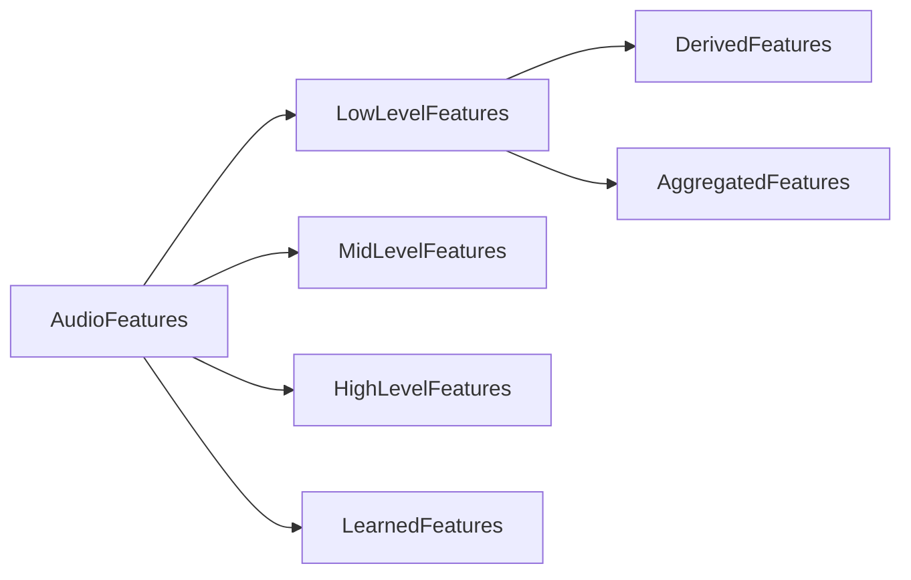
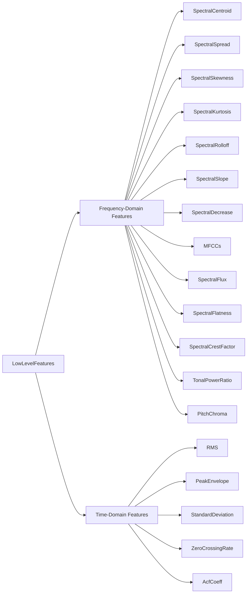
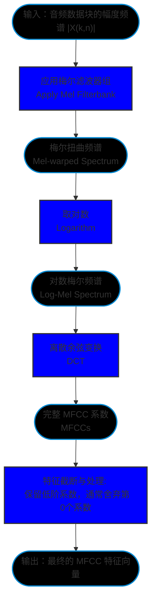

# pyACA相关的研究

## 0.pyACA是什么

pyACA是[Alexanderlerch](https://github.com/alexanderlerch)为他的图书[An Introduction to Audio Content Analysis](https://www.audiocontentanalysis.org/)(以下简称**ACA**)所搭建的python library

## 1.声音的特征是什么

在ACA中将音频特征(声音的特征)分为多个类别:
从音乐性、语义性或感知意义的抽象程度可以分类成
- 底层特征(Low Level Features)
- 中层特征(Mid Level Features)
- 高层特征(High Level Features)

具体而言，虽然学术界对中层和高层特征并没有极其严格的正式分界线，但普遍的共识是：特征的层级越高，其代表的音乐和感知意义就越明确

1. 底层特征（Low-level / Instantaneous Features）
    音频的底层特征主要代表音频信号局部的物理和数学属性（如频谱的形状、能量的波动等），通常本身不具备直接的音乐、音乐学或人类听觉感知上的意义
    它们是音频内容分析的最基础模块，主要被用来作为构建和推导更具意义的高层特征的“建筑基石”
    频谱质心（Spectral Centroid）、过零率（Zero Crossing Rate）、均方根（RMS）等都属于这一类。

2. 中层特征（Mid-level Features）
    中层特征具有清晰的音乐或声学感知属性，代表了音乐中具体的某一维度
    书中明确指出的中层特征例子是音乐的速度（Tempo）
    其他诸如音高（Pitch）、节拍（Beat）或和弦（Chord）等概念也通常被视为中层表示

3. 高层特征（High-level Features）
    高层特征代表了人类在对音乐进行分类时所使用的高度抽象的感知概念和语义标签
    这些概念通常非常复杂，无法由单一的物理属性决定，而是需要综合提取音色、音调、强度和时间等多个维度的底层/中层特征才能推导出来
    比如音乐流派（Musical Genre）
    以及音乐的情感/情绪内容（Mood / Affective Content）

-框图如下

## 2.底层特征的分类

书中对于底层特征的另一种说法是瞬时特征(Instantaneous Features),其定义是基于切分好的短时音频数据块（block）进行计算，每个数据块生成一个对应的数值(或向量)

因为这类特征本身通常不直接具备明确的音乐、音乐学或人类听觉感知上的高级含义，所以它们被统称为“底层”特征

底层特征应该具有以下的属性(ACA p.40)
- 具有较高的“鉴别”或描述能力，因为特征应适合且与当前任务相关
- 与其他特征不相关，因为每个特征应提供新信息以避免冗余，
- 对无关因素的不变性，以确保特征能够抵御诸如输入音频信号的线性变换（如缩放和滤波操作低通滤波、混响）、添加诸如（背景）噪声、编码伪影，以及非线性操作（如失真和削波）的应用
- 合理的计算复杂度，以确保该特征能够在目标平台（如移动设备）上计算，并满足相应应用的需求

## 3.频域的底层特征

:::NOTE
书中强调找一个简单一致,与具体任务无关,又不存在类别重叠的严格分类是非常困难的,所以书中只是简单的罗列了这些特征(p.41)

但是根据pyACA的代码设计,我们可以清晰的发现作者将底层特征分为了两个大类:
- **FetureSpectral**
- **FetureTime**

为了叙事的简便性,我在后文也将按照这个分类来记载底层特征
:::

- 框图

### 3.1 Spectral Centroid

1. 是什么

    频谱质心(SpectralCentroid)是频谱分布的重心

2. 代表了声音的什么方面

    明亮度(Brightness)
    尖锐度(Sharpness)

3. 怎么计算

    - 基于幅度谱(标准算法)

    $$ 
    V_{SC}(n) = \frac{\sum_{k=0}^{K/2} k \cdot |X(k,n)|}{\sum_{k=0}^{K/2} |X(k,n)|} 
    $$ 

    - 基于功率谱

    $$ 
    V_{SC}(n) = \frac{\sum_{k=0}^{K/2} k \cdot |X(k,n)|^2}{\sum_{k=0}^{K/2} |X(k,n)|^2} 
    $$ 

    - 对数频率尺度(MPEG-7)

    $$ 
    V_{SC}(n) = \frac{\sum_{k=k(f_{min})}^{K/2} log_2\frac{f(k)}{f_{ref}} \cdot |X(k,n)|^2 }{\sum_{k=k(f_{min})}^{K/2} |X(k,n)|^2} 
    $$ 

4. 得出来的结果是什么

    - Bin Index

    $$0 \leq V_{SC}(n) \leq \Kappa/2$$

5. 有什么用途

    - 音色描述与分类 

    - 实时音频特效 

    - 声音场景分析与分割 

    - 语音/唱歌识别 

:::Note
没有声音的时候要注意分母不能为0
:::

### 3.2 Spectral Spread(Bandwidth)

1. 是什么

    频谱扩散(SpectralSpread)衡量的是频谱能量分布的广度。如果说频谱质心是这个分布的均值，那么频谱展开就可以被直接看作是该分布的标准差（Standard Deviation）
    
    它有时也被称为音频的“瞬时带宽（instantaneous bandwidth）

2. 代表了声音的什么方面

    它主要对应人类感知的“音色的丰满度”或“模糊度”：

    低带宽：声音的能量高度集中在某几个频率点，听起来表现为“纯净”、“尖锐”或“像正弦波”。

    高带宽：声音的能量分布非常宽广，听起来表现为“嘈杂”、“沙哑”、“气感强”或“富有层次”。
    
    例如

    白噪声：拥有极高的频谱带宽。
    纯音（Sine Wave）：带宽接近于零。
    打击乐（如镲片）：带宽通常很高。

3. 怎么计算

    - 标准算法

    $$
    V_{SS}(n) = \sqrt{\frac{\sum_{k=0}^{K/2} (k - V_{SC}(n))^2 \cdot |X(k,n)|}{\sum_{k=0}^{K/2} |X(k,n)|}}
    $$

    - 对数尺度(MPEG-7)

    $$
    V_{SS,log}(n) = \frac{\sum_{k=k(f_{min})}^{K/2} (log_2(\frac{f(k)}{f_{ref}}) - V_{SC}(n)) \cdot |X(k,n)|^2 }{\sum_{k=k(f_{min})}^{K/2} |X(k,n)|^2} 
    $$ 

4. 得出来的结果是什么

    - Bin Index

    $$0 \leq V_{SC}(n) \leq \Kappa/4 $$

5. 有什么用途

    - 作为底层特征输入给分类器

    - 作为推导更高阶特征的基础数据
:::Note
结果可以转换为具体的Hz也可以归一化到0-1的区间
:::

### 3.3 Spectral Skewness

1. 是什么

    频谱偏度(SpectralSkewness)是基于概率分布的三阶中心矩推导出来的 它主要用于衡量频谱幅度值在频谱质心周围分布的不对称性
    
2. 代表了声音的什么方面

    与质心和展开一样，它属于描述音频的底层频域特征，反映了声音频谱包络形状的倾斜趋势

3. 怎么计算

    $$
    v_{SSk}(n) = \frac{\sum_{k=0}^{\mathcal{K}/2} (k - v_{SC}(n))^3 \cdot |X(k,n)|}{v_{SS}^3 \cdot \sum_{k=0}^{\mathcal{K}/2} |X(k,n)|}
    $$

   

4. 得出来的结果是什么

    - Value

    等于 0：表示频谱分布是完美对称的

    正值（右偏）：表示分布的重心偏向左侧（低频），长尾巴拖在右侧。通常，具有显著低频能量的信号会得出较高的正值

    负值（左偏）：表示分布的重心偏向右侧，长尾拖在左侧

    接近 0 的值：对于宽频的噪声信号，由于能量分布比较均匀/随机，偏度通常会降至接近 0

5. 有什么用途

    它作为描述音频频域形状的补充特征，为机器学习模型提供关于声音能量集中偏向的信息。在统计上，偏度还可以作为一种快速的方法，用来检验某个音频特征的分布是否接近高斯（正态）分布（高斯分布的偏度为0）

:::Note
:::

### 3.4 Spectral Kurtosis

1. 是什么

    频谱峰度(SpectralKurtosis)是基于概率分布的四阶中心矩推导出来的
    它衡量的是频谱分布的“非高斯性”（non-Gaussianity），具体来说，它反映了频谱分布相对于标准高斯分布而言，是更加平坦还是更加尖锐（凸起）

2. 代表了声音的什么方面

    它同样是描述音色和频谱包络形状的底层特征
    它捕捉的是声音频谱中是否含有极其突出的单一频率成分（如清晰的泛音），或者是缺乏突出频率成分的平坦声音。

3. 怎么计算

    $$
    v_{SK}(n) = \frac{\sum_{k=0}^{\mathcal{K}/2} (k - v_{SC}(n))^4 \cdot |X(k,n)|}{v_{SS}^4 \cdot \sum_{k=0}^{\mathcal{K}/2} |X(k,n)|} - 3
    $$

4. 得出来的结果是什么

    - Value

    等于 0（常峰态 / mesokurtic）：表示频谱分布的形状与标准高斯分布相似

    正值（尖峰态 / leptokurtic）：表示频谱存在非常尖锐的峰值。例如，在乐器（如萨克斯风）清晰演奏音符的期间，由于能量高度集中在基频和几个谐波上，会得出很高的正值

    负值（低峰态 / platykurtic）：表示频谱分布比高斯分布更平坦、更宽。在音乐暂停或充满底噪的期间，由于缺乏突出的音调峰值，该数值会显著下降

5. 有什么用途

    频谱峰度通常与偏度等特征结合使用，用于分类器识别特定的乐器或音频纹理（如区分明显的音调信号与宽带噪声）。此外，在统计评估中，它也可用于衡量数据分布的平坦/尖锐程度，辅助判断特征是否符合高斯分布假设

:::Note
    
:::

### 3.5 Spectral Rolloff

1. 是什么

    频谱滚降(SpectralRolloff)用来衡量音频数据块的带宽

2. 代表了声音的什么方面

    它属于描述声音数据块的能量分布范围和有效带宽

        低数值：表明高频成分微弱、声音有效带宽较低。例如在一件单音乐器（如萨克斯风）清晰演奏某个音符期间，该特征的数值通常相对较低且稳定
        高数值：表明高频能量充足、声音带宽很宽。例如在音乐暂停或充满宽频底噪的期间，由于噪声分布广泛，其数值会显著升高，且往往表现出不规律的剧烈波动

3. 怎么计算

    其核心逻辑是寻找一个“截止频率”：在这个频率之下的所有频谱能量之和，刚好达到该音频帧总频谱能量的某个特定百分比 κ（最常用的 κ 值为 85% 或 95%）

    全局的频谱滚降 

    $$
    v_{SR}(n) = k_r \quad \text{满足} \quad \sum_{k=0}^{k_r} |X(k,n)| = \kappa \cdot \sum_{k=0}^{\mathcal{K}/2} |X(k,n)|
    $$

    约束范围的频谱滚降 (实际应用中常见)

    $$
    v_{SR,\Delta f} (n) = k_r \quad \text{满足} \quad \sum_{k=k(f_{min})}^{k_r} |X(k,n)| = \kappa \cdot \sum_{k=k(f_{min})}^{k(f_{max})} |X(k,n)|
    $$

    极低的频率或极高的频率成分通常被认为是不必要的、或者是无用的噪声干扰（unnecessary or unwanted）例如，极低频可能只有环境底噪或录音设备的电流声。如果使用第一个全局公式，这些无用的极端频率能量就会干扰真实信号的带宽测量。 因此，第二个公式通过设定了明确的起止边界，让系统能够排除极端频段的干扰，只在真正有用或感官上有意义的频率范围内寻找能量衰减的边界

4. 得出来的结果是什么

    - Bin Index

    $$
    0 \leq V_{SR}(n) \leq \Kappa/2 
    $$

5. 有什么用途

    作为一种非常直观的带宽度量方式，它常被用作音频内容分析系统的底层特征输入。通过它可以快速区分高带宽的噪声/打击乐信号与低带宽的纯音/谐波信号
    结合Centroid、Skewness等特征，它能为机器学习模型（如语音/音乐分类器、音乐流派分类器等）提供关于声音频谱分布极限的重要边界信息

:::Note
与前面提到的频域特征一样，频谱滚降在输入完全静音的帧时在数学上是未定义的，实际代码中需要做异常处理以防止报错
:::

### 3.6 Spectral Decrease

1. 是什么

    频谱衰减（Spectral Decrease）是一种用来估算频谱包络随频率下降的陡峭程度的底层特征

2. 代表了声音的什么方面

    它量化能量是否集中在极低的频段以及高频成分随频率衰减的剧烈程度

3. 怎么计算

    它的计算方法是计算每个频率仓的幅度值与第 0 个频率仓（通常代表直流分量或极低频分量）幅度值之间的差值，并乘以该频率仓索引倒数（1/k）的权重进行求和。最后，将其除以除了第 0 仓之外的所有频率幅度总和以进行归一化。

    $$
    v_{SD}(n) = \frac{\sum_{k=1}^{\mathcal{K}/2} \frac{1}{k} \cdot (|X(k,n)| - |X(0,n)|)}{\sum_{k=1}^{\mathcal{K}/2} |X(k,n)|}
    $$

4. 得出来的结果是什么

    - Value

    计算得出的结果是一个满足 $$ V_{SD}(n) \leq 1 $$ 的数值
。
物理含义：较低的数值表明频谱的能量高度集中在最低的频段（即 bin 0 附近）

5. 有什么用途

    尽管它在理论上被设计用来描述频谱包络的下降趋势，但在实际工程与观察中，作者发现很难从它的动态曲线中得出任何有用的结论
    。尤其是在音乐暂停、充满底噪的静音期间，这个特征的数值会表现出极其不规律的剧烈波动
    正是因为它的解释性差且容易产生波动，书中明确指出：这个特征在实际的音频分析系统中并不常用
:::Note
    
:::

### 3.7 Spectral Slope

1. 是什么

    频谱斜率（Spectral Slope）与频谱衰减（Spectral Decrease）类似，是一种用来衡量频谱形状倾斜程度的特征
    它是通过对幅度频谱进行线性近似计算得出的，具体来说，就是将幅度谱视为频率的线性函数，并使用**线性回归**方法来估算这条拟合直线的斜率

2. 代表了声音的什么方面

    它直观地反映了声音信号的能量随着频率增加而产生的整体线性下降（或上升）趋势。

3. 怎么计算

    线性回归公式

    $$ 
    \hat{y}(n) = m \cdot v(n) + c
    $$

    斜率公式

    $$
    m = \frac{\sum_{r=0}^{\mathcal{R}-1} (y(r) - \mu_y) \cdot (v(r) - \mu_v)}{\sum_{r=0}^{\mathcal{R}-1} (v(r) - \mu_v)^2} 
    $$

    频谱斜率

    $$
    v_{SSl}(n) = \frac{\sum_{k=0}^{\mathcal{K}/2} (k - \mu_k)(|X(k,n)| - \mu_{|X|})}{\sum_{k=0}^{\mathcal{K}/2} (k - \mu_k)^2}
    $$

4. 得出来的结果是什么

    - Range 取决于频谱幅度的振幅范围,并没有固定的边界

5. 有什么用途

    频谱斜率可以帮助音频内容分析系统（如乐器识别、语音/音乐分类等）区分具有强烈且丰富泛音序列的乐音信号（斜率极负）与频谱分布均匀的宽带噪声信号（斜率平坦）

:::Note
    
:::

### 3.8 MFCCs(Mel Frequency Cepstral Coefficients)

1. 是什么

    MFCC（梅尔频率倒谱系数）是对音频信号频谱包络形状的一种紧凑描述
    它是结合了人类听觉对频率的非线性感知规律（梅尔刻度/Mel scale）以及倒谱分析（Cepstral analysis）技术推导出来的一组特征系数

2. 代表了声音的什么方面

    频谱的梅尔变形常导致人们认为MFCC是“感知”特征。这仅部分正确，因为没有心理声学证据支持应用DCT。此外，MFCC与已知的感知维度之间也没有直接关联。

3. 怎么计算

    - 倒谱

        $$
        cx(i) = \mathcal{F}^{-1}\{\log(X(j\omega))\}
        $$

    - MFCCs

        $$
        v^j_{MFCC}(n) = \sum_{k'=1}^{\mathcal{K}'} \log(|X_{warp}(k',n)|) \cdot \cos \left( j \cdot \left( k' - \frac{1}{2} \right) \frac{\pi}{\mathcal{K}'} \right)
        $$

    - 过程

4. 得出来的结果是什么

    对一段完整的音频信号计算 MFCC，得出来的结果是一个二维数组（二维矩阵）
    这个二维数组的两个维度分别代表着声音的特征特征维度和时间维度：

        1. 第一维：
        代表 MFCC 系数的阶数（索引 j）
        数组的每一行就对应着某一个特定阶数的 MFCC 系数曲线

        2. 第二维：
        代表音频数据块/时间帧的索引（索引 n）
        MFCC 的提取是逐帧进行的，数组的每一列就代表了音频在某一个STFT片段（帧）内提取出的一组 MFCC 特征值

5. 有什么用途

    自1980年问世以来，MFCC在语音信号处理领域得到了广泛应用，并且已被证实同样适用于音乐信号处理应用。在音频信号分类领域，研究表明生成的MFCC中的一小部分子集已包含主要信息(在大多数情况下，所用MFCC的数量在4到20之间)。
    如今，MFCC可能是基线系统中最常用的音频特征，因为它们在广泛的任务中已证明具有鲁棒性和实用性。该计算方法与倒谱计算密切相关，因为它是对频谱表示施加对数变换后的结果。其与标准倒谱的主要区别在于：采用扭曲的非线性频率尺度（梅尔尺度，参见第7.1.1节）来建模人类对频率的非线性感知，并且使用离散余弦变换（DCT）而非离散傅里叶变换（DFT）。

:::Note
尽管 MFCC 是音频分析中最成功的特征之一，但它在“可解释性”上具有局限性：

    1.缺乏直观物理意义：
    尽管它们在工程上被证明极其有用，但我们很难找出这些系数与输入音频信号之间非平凡的（nontrivial）、直观的对应关系
    也就是说，除了第 0 个系数代表能量外，我们无法像解释“频谱质心代表明亮度”那样，直接指出第 2 个或第 3 个系数具体代表人类听觉中的哪个感知维度。
    2.并非纯粹的感知特征：
    虽然计算过程中的“梅尔尺度”是基于人类听觉感知的，但并没有心理声学的证据能直接证明“离散余弦变换（DCT）”这一步符合人类听觉机制

因此，不能单纯地将这组系数视为等价于人类听觉感知的特征
:::

### 3.9 Spectral Flux

1. 是什么

    频谱通量（Spectral Flux）是一种用来衡量频谱形状随时间变化量的特征，频谱通量专门用于测量频谱的动态变化程度

2. 代表了声音的什么方面

    它反映了声音信号在相邻时间帧之间频谱波动的剧烈程度。
    在听觉感知上，书中指出这种频谱级别的准周期性变化或激励模式的调制，在某种程度上与人类听觉对声音的**粗糙度**的感知体验相关联

3. 怎么计算

    它的核心计算逻辑是求取相邻两帧短时傅里叶变换（STFT）幅度谱之间的平均差异。通常情况下，它是通过计算这两帧频谱之间的**欧氏距离**来实现的

    - 泛化公式

    $$
    v_{SF}(n, \beta) = \frac{\sqrt[\beta]{\sum_{k=0}^{\mathcal{K}/2} \left| |X(k,n)| - |X(k,n-1)| \right|^\beta}}{\mathcal{K}/2 + 1}
    $$

    在这个泛化公式中，参数 β 决定了计算相邻频谱帧之间差异时所使用的距离度量标准（Distance Norm）
    通常情况下，β 的取值范围在 [0.25,3] 之间
    欧氏距离与曼哈顿距离在这里的运用：
    1. 欧氏距离 (Euclidean Distance, 对应 β=2)
    - 当 β=2 时，上述泛化公式就退化为了最标准的频谱通量公式
    此时，系统计算的是相邻两帧频谱在多维空间中的直线距离，即 L2 范数（L2 Norm）
    - 在公式中，它会将每个频率仓的幅度差值平方，求和后再开平方根
    - 由于采用了平方运算，欧氏距离会显著放大（惩罚）那些差异较大的频率仓。这意味着，如果声音在某个特定频段发生了剧烈的能量突变（例如某个音符的强烈起始），该距离指标会迅速上升，因此它对频谱中的极端波动非常敏感。
    2. 曼哈顿距离 (Manhattan Distance, 对应 β=1)
    - 当 β=1 时，公式中的平方和开平方根操作被抵消，系统计算的是相邻两帧频谱特征之间的绝对误差之和，即 L1 范数（L1 Norm，或称城市街区距离）
    - 此时公式相当于直接计算所有频率仓幅度差值的绝对值总和，最后除以频率仓的总数进行归一化
    - 与欧氏距离相比，曼哈顿距离对所有频率仓的差异进行线性累加。它不会过度放大某个单一频段的剧烈变化，而是平等地对待频谱中每一处的微小或巨大差异。这种特性使得它在处理包含大量微小噪声波动的音频时，可能呈现出与欧氏距离不同的动态平滑度。

4. 得出来的结果是什么

    - Value

    计算得出的结果是一个满足 $$ V_{SD}(n) \leq A $$ 的数值

    $$A$$ 取决于信号的归一化方式与频谱幅度的最大范围

    - 低数值：
    当声音处于稳定的持续阶段（如平稳地吹奏一个音符）或处于背景噪音较低的静音停顿期时，特征数值会非常低
    - 高数值：
    当声音发生音高变化，或者在一个新音符刚开始被演奏的瞬间（即存在transients时），数值会形成明显的尖峰

5. 有什么用途

    频谱通量核心的用途是在**音符起始点检测（Onset Detection）系统中作为新颖性函数（Novelty Function）**使用

:::Note
    
:::

### 3.10 Spectral Crest Factor

1. 是什么

    频谱波峰因数（Spectral Crest Factor）是一种用来估算频谱有多"正弦波"的底层特征

2. 代表了声音的什么方面

    它是一种用来衡量声音**Tonalness**的简单度量方式。它主要用来粗略地评估信号中“具有明确音高的乐音（Tonal）成分”与“宽带噪声（Noisy）成分”之间的比例分布

3. 怎么计算

    提取当前分析块幅度频谱中的最大值（Maximum），并将其除以该幅度频谱中所有频率仓幅度的总和（Sum）

    $$
    v_{Tsc}(n) = \frac{\max_{0 \le k \le \mathcal{K}/2} |X(k,n)|}{\sum_{k=0}^{\mathcal{K}/2} |X(k,n)|}
    $$

    在某些算法实现中，分母不使用所有幅度的“总和”，而是使用幅度频谱的**Arithmetic mean**来进行归一化

4. 得出来的结果是什么

    使用标准公式计算得出的结果落在 $$  \frac{2} {K+2} \leq V_{T_{SC}}(n) \leq 1   $$  之间（其中 K 为音频数据块的样本数）

    如果采用以算术均值作为分母的变体公式，其结果范围会被缩放到 $$ 1 \leq V_{T_{SC}} \leq \frac{K+2}{2} $$

5. 有什么用途

    作为一种衡量音调性的直观特征，常被用于区分音频中的乐音/谐波成分与噪声/打击乐成分
    在机器学习系统中，可为音频内容分析（如语音与音乐的分类、乐器识别或音频分割）提供关于频谱能量集中度的关键线索。

:::Note
    
:::

### 3.11 Spectral Flatness

1. 是什么

    频谱平坦度（Spectral Flatness）是一种衡量频谱分布形态的底层频域特征，它的本质是幅度频谱的**Geometric mean**与**Arithmetic mean**之间的比值

2. 代表了声音的什么方面

    它代表了声音的平坦程度
    与之前介绍的用于衡量“音调性”的频谱波峰因数相反，频谱平坦度被用来评估频谱能量是均匀分布（白噪声）还是集中在少数频段（乐音）

3. 怎么计算

    其核心计算逻辑是将频谱的几何平均值除以算术平均值
    在实际工程中，为了避免连乘导致的数值溢出和精度问题，分子中的几何平均值通常通过“对数幅度谱的算术平均值再取指数”的方式来近似计算

    $$
    v_{Tf}(n) = \frac{\sqrt[\mathcal{K}/2]{\prod_{k=0}^{\mathcal{K}/2-1} |X(k,n)|}}{\frac{2}{\mathcal{K}} \sum_{k=0}^{\mathcal{K}/2-1} |X(k,n)|} = \frac{\exp \left( \frac{2}{\mathcal{K}} \sum_{k=0}^{\mathcal{K}/2-1} \log(|X(k,n)|) \right)}{\frac{2}{\mathcal{K}} \sum_{k=0}^{\mathcal{K}/2-1} |X(k,n)|}
    $$

4. 得出来的结果是什么

    -Value

    计算得出的结果是一个大于 0 的数值，具体的上限取决于频谱幅度的最大振幅范围

5. 有什么用途

    它常被用作区分声音中噪声成分与乐音成分的关键指标
    在实际的高级音频分析系统（例如 MPEG-7 标准）中，为了获取更细致和更有用的信息，通常不会在整个频谱上只计算一个全局的平坦度
    相反，系统往往会将关注的频率范围（如 250 Hz 到 16 kHz）划分为多个部分重叠的频带（如 24 个四分之一倍频程频带），然后在每个子频带内独立计算平坦度，从而为机器学习模型提供一组多维的特征向量
:::Note
    
:::

### 3.12 Spectral Tonal Power Ratio

1. 是什么

    音调功率比（Tonal Power Ratio）是一种用来计算和评估频谱“Tonalness”的底层特征
    它的核心思想是计算频谱中“音调成分的功率”与“整体频谱总功率”之间的比值

2. 代表了声音的什么方面

    它代表了声音的Tonalness
    与之前介绍的频谱波峰因数类似，它被用来评估音频信号中具有明确音高的乐音成分与无明确音高的宽带噪声成分之间的比例关系

3. 怎么计算

    计算它的关键在于如何估算“音调功率”($$ E_T(n) $$)。书中给出的一种简单估算方法是：在功率谱中寻找满足以下两个条件的频率仓（bins），并将它们的功率相加作为 $$ E_T(n) $$, 他需要满足两个条件:

    1. 它必须是一个局部最大值（Local maximum），即满足：

    $$
    ∣X(k−1,n) ∣^2 \leq ∣ X(k,n) ∣^2 \geq ∣X(k+1,n) ∣^2 
    $$

    2. 它的功率必须大于某个预设的阈值 $$ G_T $$
    $$ G_T $$ 必须设置得足够高以屏蔽掉背景噪声的随机毛刺，同时又要足够低以确保能捕捉到乐音的高次泛音。

    最后，将估算出的音调功率除以当前块的所有频率幅度平方和（即总功率）

    公式如下

    $$
    v_{Tpr}(n) = \frac{E_T(n)}{\sum_{k=0}^{\mathcal{K}/2} |X(k,n)|^2}
    $$

4. 得出来的结果是什么

    计算得出的结果是一个落在 $$ 0 \leq V_{Tpr}(n) \leq 1 $$ 之间的数值

    低数值：暗示频谱分布平坦（类似噪声）或者输入电平极低
    在充满底噪的音乐停顿/静音期间，它的数值趋近于 0；而在一个音符刚开始演奏的瞬间（transients），该数值也会出现明显的下降
    高数值：表明频谱具有强烈的音调特征，通常出现在稳定的乐音演奏段落

5. 有什么用途

    一个可靠的音调性检测器

:::Note
在书本提供的 MATLAB 源代码中，使用 findpeaks 找到所有的局部最大值，紧接着使用 find(afPeaks > G_T) 这个判断条件，强行把那些功率低于 G 
T的“假峰”剔除掉
:::

## 4.时域的底层特征

### 4.1 Time Maximum of Autocorrelation Function

1. 是什么

    自相关函数最大值（ACF Maximum）是一种通常在时域提取的音频特征，它通过计算时间信号的自相关函数（ACF），并找出其中全局最大绝对值来代表信号的特性

2. 代表了声音的什么方面

    它代表了声音信号的Tonalness与Periodicity
    自相关函数在延迟量（lag）与信号固有的周期波长相匹配时会产生局部最大值
    信号越不具备周期性（即越缺乏明确的音调），这些最大值就越低
    因此，提取自相关函数的全局最大绝对值，可以作为估算信号音调性强弱的一种简单指标

3. 怎么计算

    核心是在当前块中寻找自相关函数 $$|r_{xx}(\eta,n)|$$ 的最大值

    剔除主瓣（Main Lobe）干扰：
    由于自相关函数在延迟量 η=0 附近必然会出现最大的主瓣（此时信号与其自身未偏移状态完全重合），为了得到有意义的结果，必须忽略主瓣内的值

    设定搜索起点 $$ {\eta}_{start} $$ :
    在实际计算中，必须通过某些策略来设定搜索起点的延迟量 $$ {\eta}_{start} $$ 例如：设置一个由最高预期频率决定的最小延迟量、寻找函数跌破某个预设阈值的最小幅度位置，或者从第一个局部最小值之后才开始搜索

    书中介绍了三个可行的策略

    1. Minimum lag（最小延迟量） 

        这是一种基于频率范围的固定截断方法。它的前提是假设我们感兴趣的最大值不会出现在极高的频率处（因为高频对应着极小的延迟量和周期长度）
        因此，系统可以直接设定一个预定义的最小延迟量，并忽略比它小的所有延迟值
        预期的最高频率越低，这个最小延迟量就可以设置得越大
        例如，在 48 kHz 采样率下，如果预期最高频率为 1920 Hz，那么就可以将最小延迟量设为 25 个样本
    
    2. Minimum magnitude threshold（最小幅度/幅值阈值） 

        这是一种基于阈值的动态设定方法。它将搜索起点 $$ {\eta}_{start} $$ 
        设置为自相关函数 $$ r_{xx} $$  首次跌破（跨越）某个预设阈值 $$ G_r $$ 时的最小延迟量
        也就是说，当自相关函数从 η=0 处的最大值开始下降，只有当它的值降到某条“安全线”以下，系统才认为已经走出了主瓣的范围，从而开始寻找最大值

    3. Search range from the first local minimum（从第一个局部最小值开始的搜索范围）

        这是一种基于曲线形态的设定方法。它的规则是：只考虑延迟量大于“第一个”局部最小值所在位置的峰值
        这个设计的核心思想是利用函数曲线的第一个“谷底”作为主瓣结束的天然边界，从而避免错误地将 η=0 附近主瓣上的无意义局部最大值当作真正的周期峰值
        不过书中也提醒，对于某些特定的信号，局部最小值可能会出现在非常短的延迟位置

    在实际的工程应用中，为了最大程度保证可靠性，通常会将这几种方法结合使用，并加上一些特定问题的约束条件，来设定搜索起点 $$ {\eta}_{start} $$
    

4. 得出来的结果是什么

    - Value

    计算得出的结果是一个满足 $$ 0 \leq V_{Ta}(n) \leq 1 $$ 的数值   

    低数值：
    表明该音频片段是一个非周期性信号（nonperiodic signal）
    例如在充满宽带噪声的停顿/静音片段，该特征数值往往处于低位

    高数值：
    表明信号具有很强的周期性（periodic signal）
    例如当乐器稳定演奏乐音（tonal segments）时，该特征会出现较高且稳定的数值

5. 有什么用途

    作为一种衡量周期性和音调性的工具，基于 ACF 的特征最适合用于单声道信号（monophonic signals）
    或者仅包含极少数基频（fundamentalfrequencies）的多音信号
    
    除了将其绝对值直接作为“音调性”特征外，自相关函数最大值所在的确切延迟位置（lag）对应了声音的基波周期
    因此它是**基频检测**和**音高追踪**系统中常用的方法之一

:::Note
    
:::

### 4.2 Time Zero Crossing Rate

1. 是什么

    过零率（Zero Crossing Rate）是一种由于计算极其简单而几十年来被广泛应用于语音和音频分析中的底层时域特征
    
    它的核心概念是统计在连续的音频数据块中，音频信号幅度改变符号（即正负电平交替，穿过零点）的次数

2. 代表了声音的什么方面

    它主要代表了声音的噪声感（Noisiness）即高频内容的多少
    
    同时，它也可以反向反映信号的周期性（Periodicity）：信号在不同数据块之间的过零率变化越大，说明信号的周期性越弱

3. 怎么计算

    其计算逻辑是遍历当前数据块中的每一个样本，计算其符号与前一个样本符号的绝对差值，求和后进行归一化
    
    计算的一个重要前提是假设输入信号的算术均值大约为 0（即没有直流偏移 DC offset）

    $$
    v_{ZC}(n) = \frac{1}{2 \cdot \mathcal{K}} \sum_{i=i_s(n)}^{i_e(n)} |\text{sign}[x(i)] - \text{sign}[x(i - 1)]|
    $$

    Sign函数的定义如下

    $$
    \text{sign}[x(i)] = 
    \begin{cases} 
    1, & \text{if } x(i) > 0 \\ 
    0, & \text{if } x(i) = 0 \\ 
    -1, & \text{if } x(i) < 0 
    \end{cases}
    $$

4. 得出来的结果是什么

    - Value

    计算得出的结果是一个满足 $$ 0 \leq V_{ZC}(n) \leq 1 $$ 的数值   

    高数值：
    表明信号中包含较多的噪声或高频成分，例如在充满宽带噪声的片段中，该特征数值往往处于高位

    低数值与长常量：
    在音高稳定的乐音演奏段落（tonal parts）中，过零率会很低，并且在音高保持不变的期间内，它会呈现出长时间的恒定不变的数值

   

5. 有什么用途

    作为最基础的时域特征之一，它经常与RMS（均方根）、频谱质心等特征结合使用，用于早期的底层音频内容分析任务（如区分语音和音乐，或评估信号的噪声程度）

:::Note
    
:::

### 4.3 Time STD(Standard Deviation)

1. 是什么

    标准差是一种统计学测量指标，用于衡量输入信号（或特征序列）围绕其算术均值（算术平均值）的分布离散程度（spread）

2. 代表了声音的什么方面

    它代表了信号的动态波动幅度。在音频波形的上下文中，如果信号没有直流偏移（即均值为 0）
    标准差就完全等价于信号的交流（AC）能量或均方根（RMS）

    在特征聚合阶段，它代表了某个音频特征在一段时间内的变化剧烈程度

3. 怎么计算

    计算方法是先求出方差（Variance），即每个样本值与均值 $$ {\mu}_v $$ 的差值的平方和的平均值，然后再对其开平方根

    $$
    \sigma_v = \sqrt{\frac{1}{\mathcal{N}} \sum_{n=0}^{\mathcal{N}-1} (v(n) - \mu_v)^2}
    $$

4. 得出来的结果是什么

    - Value

    计算得出的结果是一个满足 $$ 0 \leq {\sigma}_v \leq max(|v(n)|) $$ 的数值   

    对于完全静音或恒定不变的信号，标准差为0 
    
    信号波动越剧烈，标准差越大。它对非对称分布较为敏感

5. 有什么用途

    特征聚合（Feature Aggregation）
    特征归一化（Normalization）

:::Note
    
:::

### 4.4 Time RMS(Root Mean Square)

1. 是什么

    均方根（RMS）是最常用的底层强度（Intensity）特征之一，在音频工程中有时被直接称为“声音强度（sound intensity）

2. 代表了声音的什么方面

    它代表了音频信号在特定时间块内的**物理能量（Power）**或整体响度（Loudness）的客观量度

    由于其具有一定的积分时间（Integration time，通常为几百毫秒），它反映的是声音的持续能量

    在特征聚合阶段，它代表了某个音频特征在一段时间内的变化剧烈程度

3. 怎么计算

    通过计算数据块内所有音频样本值平方的平均值，然后再开平方根

    $$
    v_{RMS}(n) = \sqrt{\frac{1}{\mathcal{K}} \sum_{i=i_s(n)}^{i_e(n)} x(i)^2}
    $$

4. 得出来的结果是什么

    - Value

    如果输入波形的幅度被归一化到 [−1,1]，则结果 $$ 0 \leq V_{RMS}(n) \leq 1 $$    

    - 完全静音时结果为 0；
    
    - 对于最大幅度的方波或恒定的直流偏移，结果趋近于 1
    
    - 在实际应用中，RMS 通常被转换为分贝（dBFS）来表示
    
    - 与峰值包络相比，RMS 会平滑掉信号中极短的瞬态尖峰
   
5. 有什么用途

    - 响度/动态估计

    - 音频预处理与对齐

    - 流派与语音识别

:::Note
    
:::

### 4.5 Time Peak Envelope

1. 是什么

    峰值包络是一种用来描绘音频信号幅度轮廓的时域特征。它专门用于捕捉音频波形在短时间内的最大振幅（极值）

2. 代表了声音的什么方面

    与代表“平均能量”的 RMS 不同，峰值包络代表了声音的**瞬态峰值电平（Peak level）**和快速的波动

    它对打击乐的敲击瞬间、音符的突然起始等极短的动态变化非常敏感

3. 怎么计算

    提取峰值包络的数学方法是在每个音频数据块中寻找绝对值最大的样本

    $$
    v_{Peak}(n) = \max_{i_s(n) \le i \le i_e(n)} |x(i)|
    $$  

4. 得出来的结果是什么

    - Value

    如果输入波形的幅度被归一化到 [−1,1]，则结果 $$ 0 \leq V_{Peak}(n) \leq 1 $$  , 同样可被转换为分贝（dBFS）输出  

    相比于 RMS，峰值包络显示出的变化更快、更显著（faster and more pronounced changes）

    在遇到打击乐敲击时会立刻形成尖峰，而在音乐暂停期间则会显著下降。

5. 有什么用途

    过载/削波检测

    起始点检测

:::Note
PPM(Peak Program Meter)的原理之一 :-)    
:::